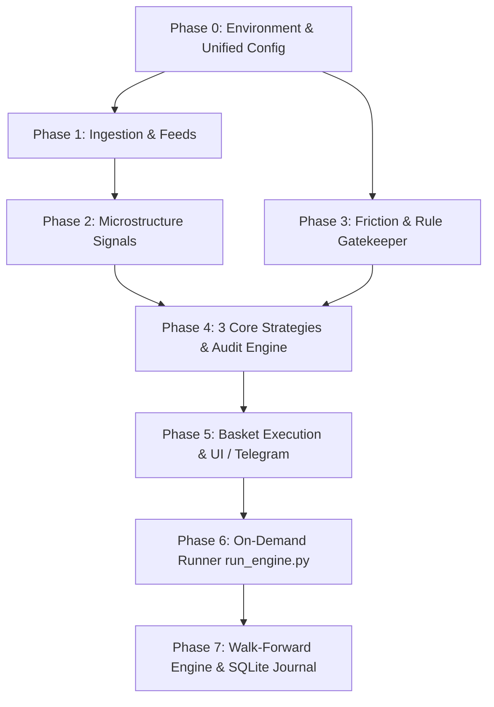

# Action Plan: Quantitative Nifty Options Decision & Execution Engine

*Document Reference:* [brd.md](file:///d:/Code/dhanopt/brd.md) (v2.1.0 Pragmatic Quant Edition)  
*Architecture:* Unix Modular Python (Stateless signals, pure functions, zero-framework test harness)  
*Target Environment:* Windows / Linux (Python 3.11+)

---

## 1. System Overview & Implementation Philosophy

The goal is to build an institutional-grade, selective intraday options execution engine for Nifty 50 weekly contracts on a ₹2,00,000 bankroll.

### Core Non-Negotiables:
1. **Capital Preservation First:** Enforce hard daily loss limit of **₹2,500 (1.25%)** and monthly drawdown cap of **₹10,000 (5.0%)**.
2. **55% Win Rate Expectancy:** Target $P_{\text{win}} \ge 55\%$ with Payoff Ratio $b \ge 1.4$ for positive net EV ($+₹610$ net per trade post Zerodha friction).
3. **The 3 Core Strategies:** Pruned from 14 to **Debit Spread**, **Credit Spread**, and **Iron Condor** (+ **NO TRADE**).
4. **Mandatory 3-Strategy Audit:** Every execution evaluates all 3 strategies and prints the exact reason why one won and why the other two failed.
5. **On-Demand Execution:** Runnable anytime between 09:30 AM and 02:30 PM IST with weekday seasonality checks (Mon–Fri).
6. **Zero-AI Risk Layer:** All risk boundaries and sizing use deterministic Python arithmetic (`RuleGatekeeper`).

---

## 2. Master Implementation Checklist by Phase



---

### Phase 0: Project Environment & Unified Configuration
**Target Files:**
* `requirements.txt`
* `.env.example`
* [config.py](file:///d:/Code/dhanopt/config.py)
* `tests/test_config.py`

- [x] **Task 0.1: Freeze Dependencies (`requirements.txt`)**
  - Minimal footprint:
    ```txt
    dhanhq>=2.0.0
    jugaad-data>=0.33.1
    pandas>=2.0.0
    rich>=13.0.0
    tenacity>=8.2.0
    python-dotenv>=1.0.0
    pyarrow>=14.0.0
    ```
- [x] **Task 0.2: Create Environment Template (`.env.example`)**
  - Declare variables: `DHAN_CLIENT_ID`, `DHAN_ACCESS_TOKEN`, `TELEGRAM_BOT_TOKEN`, `TELEGRAM_CHAT_ID`, `MOCK_MODE=True`.
- [x] **Task 0.3: Create Single Source of Truth ([config.py](file:///d:/Code/dhanopt/config.py))**
  - **Capital Constants:** `TOTAL_CAPITAL = 200000.0`, `MAX_DAILY_LOSS = 2500.0`, `MONTHLY_DRAWDOWN_CAP = 10000.0`.
  - **Contract Specs:** `NIFTY_LOT_SIZE = 75`, `STRIKE_INTERVAL = 50`.
  - **Zerodha Fees (Post-Oct 2024 SEBI Norms):** Brokerage ₹20/leg, STT 0.1% on sell turnover, Exchange 0.0505%, SEBI ₹10/Cr, Stamp 0.003%, GST 18%, Slippage 1.5 pts/leg.
  - **Weekday Window Matrix:**
    - Monday: `10:00 - 10:45` & `13:15 - 14:00`
    - Tuesday: `09:45 - 10:30` & `12:45 - 13:30`
    - Wednesday: `10:00 - 11:00` & `13:30 - 14:15`
    - Thursday: `09:35 - 10:15` & `13:15 - 14:00` (Square-off: `14:45`)
    - Friday: `10:15 - 11:00`
- [x] **Verification:** Run `python -m tests.test_config` asserting all config variables and fee schedules load correctly.

---

### Phase 1: Data Ingestion & Live Feeds (`core/feeds/`)
**Target Files:**
* `core/feeds/base.py`
* `core/feeds/dhan.py`
* `core/feeds/bhavcopy.py`
* `tests/test_feeds.py`

- [x] **Task 1.1: Base Contracts (`core/feeds/base.py`)**
  - Define standard dataclasses: `Candle`, `OptionContract`, `OptionChainSnapshot`.
  - Define abstract base class `BaseMarketFeed`.
- [x] **Task 1.2: DhanHQ Live Feed with Resilience (`core/feeds/dhan.py`)**
  - Implement `DhanFeed` wrapped with `@retry` from `tenacity` (exponential backoff: 2s to 10s, max 5 attempts on HTTP 429/timeout).
  - Method `fetch_intraday_candles(symbol, from_time="09:15", to_time=T_now, interval=5)` returning `pd.DataFrame`.
  - Method `fetch_option_chain(symbol="NIFTY", expiry=None)` fetching strikes within $\pm 300$ pts of ATM.
  - Implement offline/mock fixture for development when market is closed or API key is absent.
- [x] **Task 1.3: Historical Bhavcopy Downloader (`core/feeds/bhavcopy.py`)**
  - Integrate `jugaad-data` for automated download and decompression of NSE FO Bhavcopy archives (`fo<dd><mmm><yyyy>bhav.csv.zip`) into local `.parquet` partitions (`data/historical/`).
- [x] **Verification:** Run `python -m tests.test_feeds` testing mock candle and option chain parsing.

---

### Phase 2: Pragmatic Market Microstructure Signals (`core/signals/`)
**Target Files:**
* `core/signals/vwap.py`
* `core/signals/orb.py`
* `core/signals/vix_iv.py`
* `core/signals/oi_micro.py`
* `core/signals/ker.py`
* `tests/test_signals.py`

- [x] **Task 2.1: VWAP & Slope (`core/signals/vwap.py`)**
  - Compute cumulative VWAP: $\frac{\sum P \cdot V}{\sum V}$.
  - Compute standard deviation bands ($\pm 1.5\sigma$).
  - Compute 15-min rolling slope: $\text{Slope} = \frac{\text{VWAP}_t - \text{VWAP}_{t-3}}{\text{VWAP}_{t-3}} \times 100$.
- [x] **Task 2.2: 30-Minute Opening Range Breakout (`core/signals/orb.py`)**
  - Identify $\text{ORH}$ and $\text{ORL}$ from 09:15 to 09:45 AM.
  - Compute compression width ratio ($\text{Width} / \text{Spot} < 0.35\%$).
  - Validate breakout: 5-min candle close outside range + volume $\ge 1.4\times$ 20-day interval average.
- [x] **Task 2.3: India VIX & Option IV Dynamics (`core/signals/vix_iv.py`)**
  - Track intraday $\Delta \text{VIX} = \frac{\text{VIX}_t - \text{VIX}_{\text{prev}}}{\text{VIX}_{\text{prev}}} \times 100$.
  - Calculate Parkinson Realized Volatility $\sigma_{\text{Parkinson}}$ on 20 days.
  - Compute $\text{IV Spread} = \text{ATM Straddle IV} - \sigma_{\text{Parkinson}}$.
- [x] **Task 2.4: Open Interest & Dealer Walls (`core/signals/oi_micro.py`)**
  - Determine Put Wall (max Put OI) and Call Wall (max Call OI) within $\pm 300$ pts of ATM.
  - Calculate $\text{PCR}_{\text{OI}}$ and change in PCR: $\Delta \text{PCR} = \text{PCR}_t - \text{PCR}_{09:30}$.
- [x] **Task 2.5: Kaufman Efficiency Ratio (`core/signals/ker.py`)**
  - Compute 20-bar directional efficiency: $\frac{|\text{Price}_t - \text{Price}_{t-20}|}{\sum_{i=0}^{19} |\text{Price}_{t-i} - \text{Price}_{t-i-1}|}$.
  - Noise veto threshold: $\text{KER} < 0.35$.
- [x] **Verification:** Run `python -m tests.test_signals` verifying exact numerical outputs on a known synthetic 100-bar OHLCV DataFrame.

---

### Phase 3: Friction Accounting & Rule Gatekeeper (`core/friction/`, `core/auditors/`)
**Target Files:**
* `core/friction/zerodha.py`
* `core/auditors/rule_gatekeeper.py`
* `tests/test_friction_gate.py`

- [x] **Task 3.1: Zerodha Fee Engine (`core/friction/zerodha.py`)**
  - Calculate exact post-Oct 2024 costs for $N$-leg trades:
    - Brokerage: $N \times 2 \times ₹20$
    - STT: $0.1\%$ on sell-side option turnover
    - Exchange turnover: $0.0505\%$ on premium
    - SEBI turnover: $0.0001\%$
    - Stamp duty: $0.003\%$ on buy premium
    - GST: $18\%$ on (Brokerage + Exchange + SEBI)
    - Slippage: $1.5 \text{ pts} \times 75 \text{ qty} \times N$
  - Return dataclass `FrictionBreakdown(total_rupees, points_equivalent)`.
- [x] **Task 3.2: Deterministic Rule Gatekeeper (`core/auditors/rule_gatekeeper.py`)**
  - Sub-microsecond validation:
    - Veto 1: Max loss $> ₹2,500$ (Capital cap).
    - Veto 2: Strike OI $< 100,000$ or Bid-Ask Spread $> 1.5$ pts (Liquidity).
    - Veto 3: Expected Gross Profit $< 2.0\times$ Friction Cost (Economic hurdle).
    - Veto 4: Out-of-sample $P_{\text{win}} < 55\%$ (Edge hurdle).
- [x] **Verification:** Run `python -m tests.test_friction_gate` asserting that an uneconomic trade ($EV < 2\times$ fees) is rejected.

---

### Phase 4: The 3 Core Strategies & Comparative Audit (`core/strategies/`)
**Target Files:**
* `core/strategies/base.py`
* `core/strategies/debit_spread.py`
* `core/strategies/credit_spread.py`
* `core/strategies/iron_condor.py`
* `core/strategies/audit_engine.py`
* `tests/test_strategies.py`

- [x] **Task 4.1: Base Strategy Interface (`core/strategies/base.py`)**
  - Methods: `evaluate_gates(signals)`, `select_strikes(chain)`, `calculate_ev(params)`.
- [x] **Task 4.2: Directional Debit Spread (`core/strategies/debit_spread.py`)**
  - Bull Call: Price > VWAP, slope $>0$, KER $>0.55$, VIX $\le 16$. Long ATM ($\Delta \approx 0.50$), Short OTM ($\Delta \approx 0.25$).
  - Bear Put: Price < VWAP, slope $<0$, KER $>0.55$, VIX $\le 16$. Long ATM ($\Delta \approx 0.50$), Short OTM ($\Delta \approx 0.25$).
  - Stop-loss: 35% of net debit.
- [x] **Task 4.3: Directional Credit Spread (`core/strategies/credit_spread.py`)**
  - Bull Put: Supported by Put Wall, moderate slope, VIX $\ge 13$, rich IV spread. Buy deep OTM hedge first ($\Delta \approx 0.10$), Sell short put ($\Delta \approx 0.22$).
  - Bear Call: Capped by Call Wall, moderate slope, VIX $\ge 13$, rich IV spread. Buy deep OTM hedge first ($\Delta \approx 0.10$), Sell short call ($\Delta \approx 0.22$).
  - Stop-loss: 1.4x of credit received.
- [x] **Task 4.4: Range-Bound Iron Condor (`core/strategies/iron_condor.py`)**
  - 4 legs: Buy OTM Put & Call hedges first ($\Delta \approx 0.08$), Sell short wings at Put/Call walls ($\Delta \approx 0.20$).
  - Gates: Price inside ORB-30, KER $<0.35$, flat VWAP.
  - Stop-loss: 1.4x net credit collected.
- [x] **Task 4.5: Comparative 3-Strategy Audit Engine (`core/strategies/audit_engine.py`)**
  - Evaluates all 3 strategies simultaneously.
  - Outputs `AuditReport` containing:
    - Selected Strategy (highest friction-adjusted EV).
    - Status for all 3 strategies (`SELECTED` vs `REJECTED`).
    - Explicit invalidation reason for the other two.
    - If no strategy passes, sets verdict to `TIER 0: NO TRADE`.
- [x] **Verification:** Run `python -m tests.test_strategies` asserting that a trend breakout rejects Iron Condor with reason `"KER breaches max chop threshold"`.

---

### Phase 5: One-Click Execution & UI / Telegram Delivery (`core/execution/`, `core/ui/`)
**Target Files:**
* `core/execution/basket_builder.py`
* `core/ui/terminal_rich.py`
* `core/ui/telegram_push.py`
* `tests/test_execution_ui.py`

- [x] **Task 5.1: Zerodha Basket Builder (`core/execution/basket_builder.py`)**
  - Generates Kite Basket JSON with strict execution sequencing: **Long/Hedge legs 1st**, Short legs 2nd.
  - Generates Kite Publisher one-click deep link for mobile execution.
- [x] **Task 5.2: Multi-Panel Rich Terminal UI (`core/ui/terminal_rich.py`)**
  - Panel 1: Telemetry & Microstructure Diagnostics (Spot, VWAP slope, ORB status, VIX, Walls).
  - Panel 2: Mandatory 3-Strategy Comparative Audit Table (showing pass/fail reasons for each).
  - Panel 3: Recommended Zerodha Basket Order Sheet with Breakeven and Stop-Loss points.
- [x] **Task 5.3: Telegram Bot Dispatcher (`core/ui/telegram_push.py`)**
  - Direct HTTPS call to `api.telegram.org` using standard library `urllib.request` (zero pip bot frameworks).
  - Formats clean markdown trade card with one-click basket link.
- [x] **Verification:** Run `python -m tests.test_execution_ui` verifying JSON basket format and terminal table rendering.

---

### Phase 6: Dynamic On-Demand Runner (`run_engine.py`)
**Target Files:**
* [run_engine.py](file:///d:/Code/dhanopt/run_engine.py)

- [x] **Task 6.1: Master Pipeline Orchestration**
  - Parse CLI arguments: `--mock`, `--timestamp`, `--silent`.
  - Identify current weekday and evaluate against the weekday seasonality window.
  - Fetch candles from 09:15 up to $T_{\text{now}}$.
  - Compute signals $\to$ Execute `AuditEngine` $\to$ Validate through `RuleGatekeeper`.
  - If approved: generate basket order, print Rich terminal report, and push Telegram card.
  - If unconfirmed / off-window: print `STAND BY` report detailing trigger levels and next window.
- [x] **Verification:** Run `python run_engine.py --mock --timestamp "10:15"` and assert output generates clean terminal panels without exceptions.

---

### Phase 7: Walk-Forward Backtester & Trade Journal (`backtest/`, `core/journal/`)
**Target Files:**
* `backtest/engine.py`
* `core/journal/recorder.py`
* `data/trade_journal.sqlite`

- [x] **Task 7.1: SQLite Trade Telemetry Journal (`core/journal/recorder.py`)**
  - Table `trade_journal`: Trade ID, date, strategy, fill price, slippage, MAE, MFE, net PnL, charges, exit reason.
  - Closed-loop attribution: `REGIME_MISCLASSIFIED`, `VOL_CRUSH`, `SLIPPAGE_DRAG`, `CLEAN_WIN`.
- [x] **Task 7.2: Walk-Forward Engine (`backtest/engine.py`)**
  - 16-fold rolling walk-forward test (12-month In-Sample, 3-month Out-of-Sample) using historical Bhavcopy Parquet files.
  - Export calibrated parameters to `data/calibrated_params.json`.
- [x] **Verification:** Run `python -m tests.test_journal` verifying SQLite insertion and MAE/MFE computation.

---

## 3. Directory Structure to be Created

```
d:\Code\dhanopt\
├── AGENTS.md                  # Lazy senior dev rules
├── brd.md                     # Business Requirements Document v2.1.0
├── actionplan.md              # This actionable developer plan
├── requirements.txt           # Minimal pinned dependencies
├── .env.example               # Environment variable template
├── config.py                  # Single source of truth (fees, caps, windows)
├── run_engine.py              # On-demand master runner
├── data/                      # Local storage
│   ├── historical/            # Parquet bhavcopy archives
│   ├── trade_journal.sqlite   # Post-trade telemetry DB
│   └── calibrated_params.json # Walk-forward weights & deltas
├── core/
│   ├── feeds/                 # base.py, dhan.py, bhavcopy.py
│   ├── signals/               # vwap.py, orb.py, vix_iv.py, oi_micro.py, ker.py
│   ├── friction/              # zerodha.py
│   ├── auditors/              # rule_gatekeeper.py
│   ├── strategies/            # base.py, debit_spread.py, credit_spread.py, iron_condor.py, audit_engine.py
│   ├── execution/             # basket_builder.py
│   ├── journal/               # recorder.py
│   └── ui/                    # terminal_rich.py, telegram_push.py
├── backtest/
│   └── engine.py              # 5-Year Walk-Forward simulator
└── tests/
    ├── test_config.py
    ├── test_feeds.py
    ├── test_signals.py
    ├── test_friction_gate.py
    ├── test_strategies.py
    └── test_execution_ui.py
```

---

## 4. Verification & Testing Workflow

At each phase of development, run:

```bash
# Run all unit self-checks (zero external dependencies)
python -m unittest discover -s tests -p "test_*.py" -v

# Run the master engine in mock mode
python run_engine.py --mock --timestamp "10:15"
```
