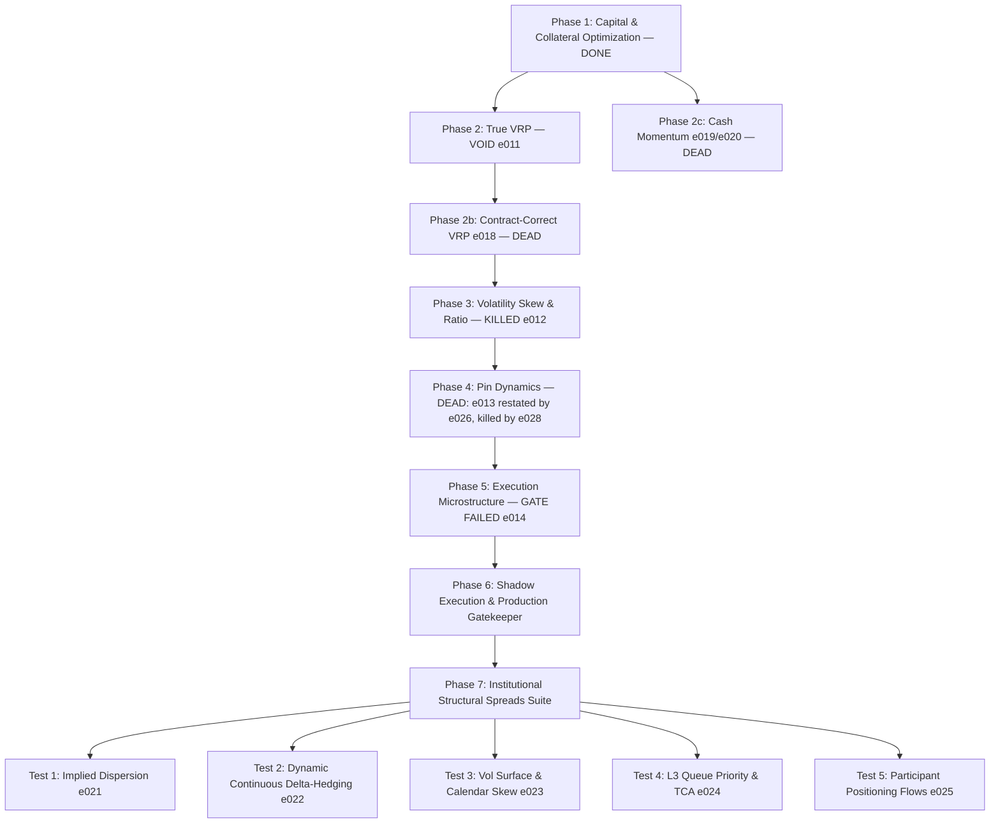
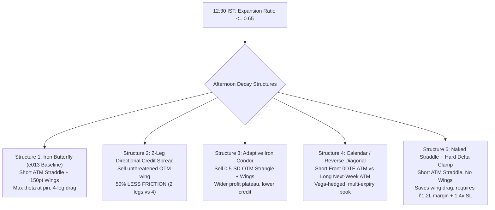
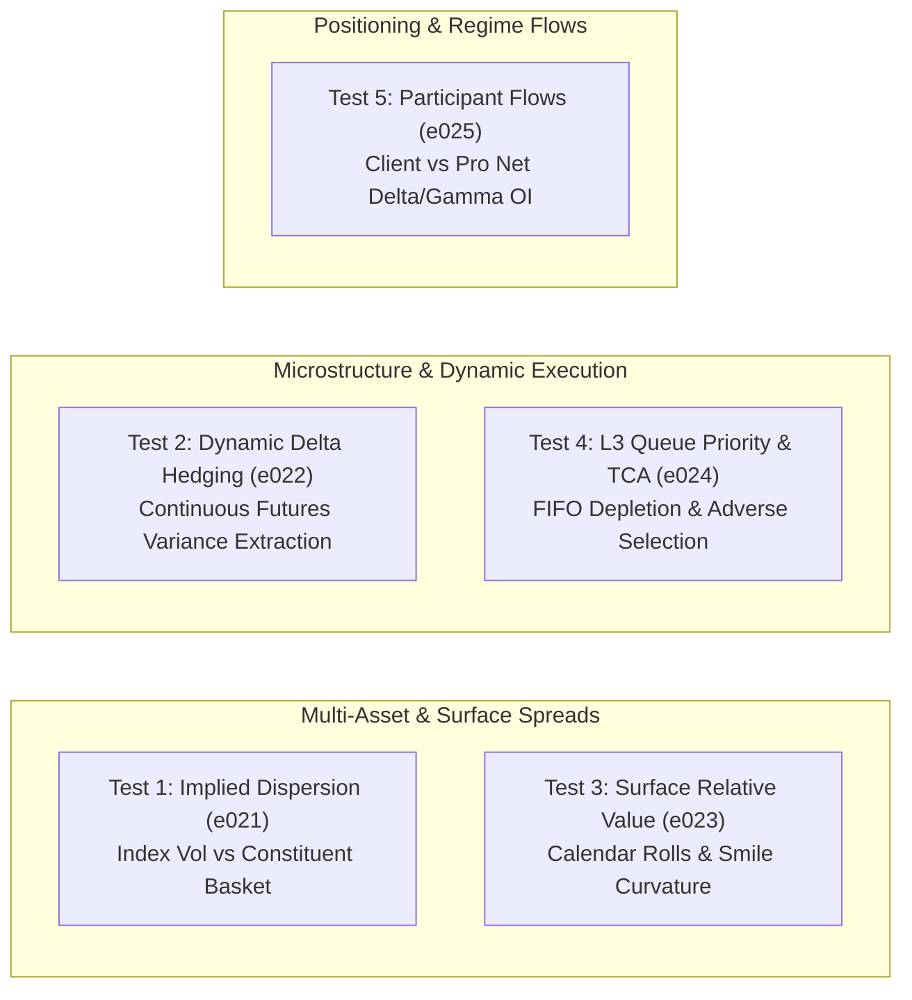

# Quantitative Action Plan: Institutional-Grade Nifty Options Engine
**Architectural Blueprint & Execution Roadmap (Kailash Nadh Perspective)**  
*Target Environment:* Windows (pwsh) / Linux (bash) | Python 3.11+ | Single Source of Truth  
*Base Capital:* ₹2,00,000 (Account Bankroll) | Current Regulatory Era: **65 Lot Size** (NSE FAOP70616)  
*Status:* Active Master Plan (Replaces Discredited BRD v2.1 Directional Models) — **revised 2026-10-02**

> **Current honest position.** Expected monthly return of this entire program: **₹885 — every rupee of it collateral yield, and nothing else.** The expected monthly return from *trading* is **₹0**. One strategy candidate (e013, the pin harvest) was the last to survive an audit; **e028 killed it on the corrected sample and there is now no candidate.** Every rupee of PnL this repo has ever printed is void or refuted. The only item outstanding with positive expected value is the collateral pledge in §1.5. Full record: [RETROSPECTIVE.md](file:///d:/Code/dhanopt/RETROSPECTIVE.md).
>
> **⚠ RESTATEMENT 2026-10-03 (e026) — and then superseded by e028 the same day.** e013's published **+₹4,14,721 is struck.** Every leg of that number was a Black-Scholes output on a stale IV; no real option price entered it. e026 re-marked to real bhavcopy closes ([experiments/e026_realmark_audit/](file:///d:/Code/dhanopt/experiments/e026_realmark_audit/)) and reported **+₹61,843 on 64 verified sessions, EV +₹966** — **and that restatement is struck too.** e026's loader compared a `date` to a raw string and silently hid four years of marks; those 64 sessions were the ones the bug had not hidden. **e028 recovered the full sample (n=129): +₹45,568 at the engine's own 0.75 pts/leg, −₹29,082 at a realistic 2.0 pts/leg (EV −₹225, PF 0.54), breakeven 1.51 pts/leg.** **e013 is DEAD. No candidate survives.** (Separately: it was never a 0DTE book — 132 of its 193 sessions trade contracts with days of life left.) **Wherever this document quotes "+₹4,14,721" or "+₹61,843", read the corrected n=129 column in §4.3.**

---

## 1. Executive Summary & Foundational Reality

Every options strategy previously celebrated in this sandbox ([e001](file:///d:/Code/dhanopt/experiments/e001_leakfree_replay) to [e010](file:///d:/Code/dhanopt/experiments/e010_ml_gate)) collapsed under rigorous audit:
1. **The Day-t Look-Ahead Leak:** Strategies relied on max-OI walls computed from **15:30 EOD option chains**, an information leak of 6 hours. When tested against real opening OI ([e007](file:///d:/Code/dhanopt/experiments/e007_open_oi)), edge collapsed from +₹940,697 to **−₹309 (4 trades, PF 0.96)**.
2. **Directional Spreads Bleed:** Naive momentum continuation ([e004](file:///d:/Code/dhanopt/experiments/e004_intraday_replay)) lost −₹314k (bull) and −₹147k (bear) under realistic intraday paths.
3. **ML Without Monetary Edge:** ML models ([e010](file:///d:/Code/dhanopt/experiments/e010_ml_gate)) achieved real statistical discrimination (Brier 0.295 < 0.318), yet lost −₹121k because the underlying spread structure possessed negative expectancy after Zerodha friction and bid-ask drag.

And on 2026-10-02, a second, deeper conviction:
4. **The Contract-Identity Defect ([e011](file:///d:/Code/dhanopt/experiments/e011_vrp_delta_hedge) and everything built on it):** the VRP signal inverted the ATM straddle of the expiry nearest to *t-1* and then shifted by one row. The contract tradable on *t* is the expiry nearest to *t*. The published **+₹7,43,572.25 (Sharpe 2.85, PF 3.99)** is void: the inverted "IV" was a bisection artifact (mean 0.476, max 1.929, 35 sessions above 1.00), and the entry gate fired **2.55× more often on roll days** — the strategy was trading its own instrumentation error. **e011, e015, e016 and e017 are void.** The fix and the re-test are §Phase 2 below.

### What the "Top 1%" Do Differently: The Paradigm Shift
Institutional quantitative and prop desks (Graviton, NK Securities, Quadeye, Tower, Jane Street) do not gamble on 5-minute directional candles, moving averages, or static 1.4× stop-loss Iron Condors. **Single-instrument 5-minute charts on Nifty options are noise: after STT, turnover charges, and crossing the bid-ask spread, their mathematical expectancy is negative.**

To find genuine alpha, research must shift from single-instrument chart patterns to **structural spreads, multi-asset relative value, and order-book microstructure**:
* Stop staring at 5-minute Nifty candles;
* Model index vs. constituent volatility (**dispersion**);
* Trade dynamic futures hedges instead of hoping static wings don't breach;
* Exploit 2D volatility surfaces, calendar roll mispricings, and skew curvature;
* Model tick-level queue priority and adverse selection instead of naive fill assumptions;
* Track participant-wise open interest flow imbalances (FII/Pro vs. retail Client).

**The Initial Scoreboard (e001–e020):**

| Structural phenomenon | Mechanism | This repo's verdict |
|---|---|---|
| **1. Variance Risk Premium** | IV systematically above RV over multi-year horizons (risk aversion, institutional hedging demand); harvested delta-neutral, not by stop-outs | **Tested twice. VOID then DEAD.** e011's result was a contract-identity artifact; e018 re-tested Option 1 on the corrected signal and lost **−₹61,306** (EV −₹435, PF 0.82, DD 48.4%). The premium is real (mean IV−RV 0.048); the *structure* cannot pay its own friction. |
| **2. Volatility Surface & Skew Asymmetry** | Monetize OTM-put overpricing (retail crashophobia) via ratio / relative-value structures | **KILLED.** e012: **−₹98,802, PF 0.13, 15 consecutive losses.** 4-leg friction turned +₹33/trade gross into −₹859/trade net. |
| **3. Gamma Inventory & Pinning** *(labelled "0DTE" — it is not)* | Market-maker delta hedging around structural strikes near expiry | **DEAD ❌ (e028). NO CANDIDATE SURVIVES.** e013 pin harvest: ~~+₹4,14,721, PF 9.41~~ struck by e026 (every leg was a Black-Scholes mark) → ~~+₹61,843, EV +₹966, PF 16.67, DD ₹1,441 on 64 sessions~~ **struck in turn by e028 — that was half the tradeable sample.** Corrected on **n=129**: **+₹45,568 at the engine's own 0.75 pts/leg, but −₹29,082 at a realistic 2.0 (EV −₹225, PF 0.54)**, breakeven **1.51 pts/leg**, 93.0% of PnL from 2025. |
| *(4. Cash-equity momentum — the popular alternative to options)* | Cross-sectional 12-1 momentum on free EOD data, "no friction decay" | **DEAD, twice, and honestly.** e019 falsified the premise (daily beat monthly 3.8×; costs ~3% of capital) and lost to its own equal-weight benchmark by **0.81 Sharpe**. e020 diluted to the top decile: 24.8% CAGR — and **+0.04 Sharpe** of excess. The return was beta. |
| **5. The Institutional Suite (Tests 1–5)** | Dispersion, continuous delta-hedging, calendar surface relative-value, L3 queue TCA, participant flow tracking | **NEW FOCUS (Phase 7 / e021–e025).** Moving beyond 5-min candles to structural spreads. |

This action plan defines the exact steps to build, test, and validate what remains and execute the 5 institutional tests, using **only data resident on disk or reachable from free/existing exchange endpoints**, eliminating all guesswork and unstated assumptions.

### 1.1 The Void & Dead Ledger (2026-10-02)

The single most important table in this document. **No figure in the "claimed" column may be used in any model, sizing table, or pitch.**

| Exp. | Claimed | Audited | Status | One-line reason |
|---|---|---|---|---|
| e001–e007 | up to +₹9.41L | −₹232,823 / −₹140,520 / −₹309 | VOID (wall leak) | Walls = day-t EOD OI; the signal was the leak. |
| e010 | ML gate, −₹1.21L | −₹1.21L | DEAD (confirmed) | Real discrimination, negative-expectancy structure. |
| **e011** | **+₹7,43,572, Sharpe 2.85** | **0** | **VOID** | Contract identity: t's contract priced with t−1's expiry and tenor. |
| e012 | — | −₹98,802, PF 0.13 | DEAD | Skew ratio spread; friction exceeds edge. |
| **e026** | — | ~~+₹61,843, EV +₹966, PF 16.67, n=64~~ | **SUPERSEDED BY e028** | The real-price audit; method sound, **sample format-selected.** Its loader compared a `date` to a raw string, so 4 years of marks never loaded. |
| **e013** | +₹4,14,721, PF 9.41 | ~~+₹61,843, PF 16.67 (64 sessions)~~ → **−₹29,082 at 2.0 pts/leg, n=129** | **DEAD ❌ (e028)** | Every leg was a Black-Scholes mark on a stale IV; struck by e026 and then **killed by e028**, which recovered the sample the expiry-encoding bug had hidden. Breakeven slippage **1.51 pts/leg**. |
| **e028** | — | **+₹45,568 @0.75 pts/leg; −₹29,082 @2.0, EV −₹225, PF 0.54, n=129** | **DEAD ❌ — THE FOURTH CONVICTION** | `expiry == str(date)`: the store holds `04-Feb-YYYY` and ISO, so **356 of 576** sessions returned an empty chain and §5.5's fail-closed rule dropped each as `NO TRADE`. Correct method, correct control — and no edge at a realistic fill. |
| **e029** | — | **NO SLICE** — 5/5 structural filters negative on 2021–2023; that era loses at 0.75, 1.5 *and* 2.0 pts/leg | **DEAD ❌ — CLOSES THE LAST DOOR** | Held-out era design (select on 2021–2023, score on 2024–2026). e013 is not a cost problem and not a dilutable slice: **the signal is regime-dependent and there is no way to know the regime before trading it.** |
| **e030** | — | **0 of 1,415 sessions have positive calendar credit.** Median **−175.15 pts** vs ₹559 friction; p90 −116.58 | **PHASE 7.3 KILLED ❌ BEFORE CODE** | Zero-PnL credit-to-fee pre-check. Indian index options carry an upward-sloping premium term structure, so sell-front/buy-back is a **debit on every session**. The IV term-structure trigger had nothing to fire on. **The only unblocked Phase 7 item, and it fell to arithmetic instead of a month of code.** |
| **e031** | — | **median net −₹734.78, EV −₹845.71/trade, total −₹9,17,593, PF 0.617, win 42.6%, n=1,085** | **DEAD ❌ — verdict contested by its own PREREG** | The mirror of e030 (buy the front, sell the back): the credit is real (**median 162.75**) but the back leg's residual time value is larger (**median 164.05**), so gross is −3.10 pts before friction and −₹735 after. **Gate 4's frozen bar rested on a wrong derivation** — spot does not enter `PnL = credit − TV₁`, but it enters *through* TV₁ because time value falls with moneyness — so it failed (ρ 0.84 vs a bar of 0.05) and the PREREG's own rule said *AUDIT VOID*. Reported under **two disclosed amendments** instead. **Superseded on verdict by e032.** |
| **e032** | — | **LEAD DEAD, 0 amendments, gate 5 the only failure; reproduces e031 on 36 pinned figures, drift 0** | **DEAD ❌ — CLEAN VERDICT; supersedes e031's contested one** | The same measurement under a gate set that was defensible when frozen. Gate 4 split into **4a wrong-leg detector** (ρ(move, credit) = 0.0978 < 0.20) and **4b time-value sign** (ρ(move, TV₁) = −0.6595 < 0); both are labelled **NEW** and **void-only**, so no bar written with the data in view can produce a positive verdict. Re-runs e031's exact configuration (§5.10) rather than re-implementing it. **Produces a verdict label, not new evidence — the sample had already been seen.** |
| e014 | Maker TCA | Maker −53%/−62% vs taker | CLOSED (negative) | E013 legs stand; E011 arms void with the book. |
| **e015** | +₹11,58,293, Sharpe 4.14 | **0** | **VOID** | Combined book inherits e011's void leg. |
| **e016** | Iron-fly wings, −₹1,56,941 | **0** | **VOID** | Wings test on the mispriced signal. |
| **e017** | Regime sizing, "needs ₹6.4L" | **0** | **VOID** | Risk budget computed on the void book. |
| **e018** | — | **−₹61,306, EV −₹435, PF 0.82, DD 48.4%** | **DEAD** (fix survives) | Correct contract identity, 0 violations — and no edge. |
| **e019** | — | monthly 3.1% / 0.34; benchmark 21.3% / 1.15 | **DEAD** | Excess Sharpe **−0.81**; friction-decay premise falsified. |
| **e020** | — | 24.8% CAGR / 1.19 Sharpe | **DEAD** | Excess Sharpe **+0.04** — the return is beta. |

*Ledger amended 2026-10-03 by **e028**. Three of the four convictions in this table are the same failure: an engine asserting a fact about its own inputs that the inputs did not support — a wall convention (§5.1), a shifted frame (§5.6), a partition that does not exist (§5.12), and now **an encoding.** Each was inherited silently by the next experiment. The structural answer is invariant §5.13.*

*Amended again 2026-10-03 by **e031/e032** — the mirror calendar, which closes the §7.3 family in both directions: e030 showed the proposed structure is a debit on every session in six years, and e031/e032 show its mirror collects a credit worth **slightly less** than the time value it pays back (median 162.75 vs 164.05). These two rows are a **different failure from the four above**: nothing was wrong with the data, the contract or the arithmetic — identity exact to 1e-13, control matching e030 to 0.0, coverage 97.2% per year. What was wrong was a **gate**, a bar derived from an argument that did not hold. The structural answer is invariant §5.16.*

**Carried forward:** the contract-identity engine, the hold-to-expiry mark path, the arithmetic-impossibility audit, the free cash price store, point-in-time liquidity, corporate-action back-adjustment, the anti-beta gate, the death-rate diagnostic, and the control-reproduces-predecessor pattern.

---

## 2. Inventory of Available Data Assets

**AUDITED 2026-10-03 against disk.** Every line below was measured, not asserted. Re-run the check any time with `python -m experiments.common.audit_inventory`. Claims that did not survive are struck and the missing inputs are listed in §2.1.

```
dhanopt/
├── data/
│   ├── historical/                     # EOD NSE FO Bhavcopy (Parquet partitions, 2021–2026)
│   │   └── year=2021..2026/month=MM/   # VERIFIED 1,415 sessions, 935 MB. Complete FO universe:
│   │                                   #   OPTIDX + FUTIDX = NIFTY, BANKNIFTY, FINNIFTY,
│   │                                   #   MIDCPNIFTY, NIFTYNXT50; ~295 OPTSTK + ~210 FUTSTK.
│   │                                   #   RELIANCE/HDFCBANK/ICICIBANK/INFY/TCS options all present.
│   │                                   #   2021-2023 and part of 2024 end 2026-09-25 (181 sessions in 2026).
│   ├── intraday/
│   │   └── interval=5/                 # VERIFIED 1,410 sessions, 12 MB, 2021-01-04 → 2026-09-25.
│   │                                   #   75 bars/session. Columns: timestamp,OHLC,volume — NO symbol
│   │                                   #   column (single instrument, identity from filename).
│   │                                   #   *** SPOT, NOT FUTURES *** (basis +0.20% to same-day front fut).
│   ├── cash/                           # FREE NSE daily CASH bhavcopy (added 2026-10-02, e019)
│   │   └── year=YYYY/month=MM/<date>   # VERIFIED 1,420 sessions, 223 MB.
│   │                                   #   ~1.8k symbols PER SESSION; 6,475 is the UNION over the store
│   │                                   #   (that union is the survivorship-safe property, not a daily count).
│   └── calibrated_params.json          # VERIFIED present (9,611 bytes)
│   #  data/participant_oi/             # *** DOES NOT EXIST *** — see §2.1. Test 5 blocked.
├── experiments/
│   ├── e008_wall_flip/artifacts/
│   │   ├── walls_576.tar.gz            # VERIFIED 576 sessions (2021-01-06 → 2026-09-22), 12.6 MB.
│   │   │                               #   75 bars/session. Chain rows = strike, side, oi, open.
│   │   │                               #   *** NO bid/ask. ATM strike present in 0/576 sessions (0.0%). ***
│   │   └── walls/<date>.json           # 576 files, same content
│   ├── e009_wall_capture/             # REGISTERED 2026-10-03. Scheduled task `e009 capture`,
│   │   ├── watchdog.py                #   MON–FRI 08:55 IST -> run_capture.cmd -> watchdog.
│   │   ├── run_capture.cmd            #   Crash-restart supervisor; resumes from disk.
│   │   #  artifacts/                  # *** not yet created *** — no session captured until the
│   │   #  snapshots/                  #   first trading session, Mon 2026-10-05. Ledger ->
│   │                                  #   artifacts/coverage_ledger.json (kill 1 evidence).
│   ├── e018_vrp_weekly/                # VERIFIED (9 entries) — contract-identity-correct VRP engine (DEAD)
│   ├── e019_momentum/                  # VERIFIED (9 entries) — cash-momentum engine (DEAD)
│   ├── e020_diluted_momentum/          # VERIFIED (7 entries) — diluted follow-up (DEAD)
│   └── common/
│       ├── lots.py                     # VERIFIED. NIFTY eras only: 75→50→25→75→65. NO stock lots.
│       ├── leak_registry.py            # VERIFIED. Information-set tracking + e011 conviction.
│       └── audit_inventory.py          # NEW: the script that audits §2 against disk.
```

### 2.1 Claims that did not survive the audit

| Claim | Plan said | Measured | Consequence |
|---|---|---|---|
| `data/participant_oi/` exists, "fetched idempotently" (§2, §7.5) | a populated store | **Directory absent. No ingestion script anywhere in the repo.** | **Test 5 (e025) cannot start.** It is a data-acquisition project, not a 2-week experiment. |
| e009 live capture accumulating | "artifacts/ — live 60-second snapshots" | **`artifacts/` does not exist.** `capture_chains.py` written, never run. | **Phase 6's entire premise is blocked.** Nothing measures e013 fills. |
| intraday store usable for Test 2 delta hedging | "NIFTY Spot **and** NIFTY Futures EOD/intraday marks" | **SPOT only** (+0.20% basis vs front fut; no fut series in the store) | Test 2 needs intraday futures marks. They must be downloaded first. |
| e008 walls carry "OI, **quotes**" | quotes available | Fields are `strike, side, oi, open` — one `open` print, **no bid/ask** | No realized spread can be measured from this store. Confirms §4.2's 0.0% ATM finding. |
| §2: cash "1,420 sessions × 6,475 symbols" | per-session | 6,475 is the **union**; ~1.8k per session | Wording only — the union is the correct survivorship-safe design. |
| §5.4: "every backtest must query lots.py" | covers all books | **NIFTY-only eras.** No stock lot table | Test 1 stock PnL would mis-scale by 3–10× without an era table. |
| Test 1 cap-weighted basket | "top 5 ≈ 58% of Nifty 50 weight" | **No index-weight file exists in the repo.** Actual top-5 sums to ~39%. | Basket is mis-specified before it is traded. |
| `trade_date` as a sortable key | (implicit) | **Two encodings**: `DD-MON-YYYY` (2021–2024) and ISO (2024–2026) | Any lexicographic sort or string compare across the boundary is silently wrong. Parse to `date` first. Filenames are authoritative (0 mismatches). |

### 2.2 What is genuinely available

Stated plainly, so nothing is double-counted: the repo has a complete **EOD** F&O universe for six years and an **EOD** cash universe for six years, plus 1,410 sessions of NIFTY **spot** 5-minute bars. It has **no** intraday futures, **no** participant-flow data, **no** index weights, **no** stock lot eras, and **no** bid/ask capture of any kind. Every Phase 7 test that needs one of those is a data project wearing a research project's clothes.

---

## 3. The Master Execution Phases



---

### Phase 1: Zero-Risk Baseline — Capital & Collateral Yield [COMPLETED ✅]
*Objective:* Guarantee an immediate, market-independent baseline yield on the ₹2,00,000 bankroll before taking any derivatives risk. Stop earning 3.0% in bank savings.
*Status:* **COMPLETED.** Engine implemented in [core/collateral.py](file:///d:/Code/dhanopt/core/collateral.py); verified in [tests/test_collateral.py](file:///d:/Code/dhanopt/tests/test_collateral.py).
*Why it matters more than it did:* with every strategy void or dead, this is the **only certified-positive flow in the program** — ~₹10.6k/yr gross at Oct-2026 rates (₹885/mo). The user action below is the highest-expected-value item outstanding in this plan.

#### 1.1 Capital Allocation & Haircut Math
Under SEBI collateral circulars, Liquid and Overnight mutual funds pledged via depository (CDSL/NSDL) count toward the **50% cash-equivalent margin** requirement with a standardized broker haircut (~10%).

| Capital Component | Allocation | Broker Haircut | Usable Collateral Margin | SEBI Classification | Gross Annual Yield |
|---|---:|---:|---:|---|---:|
| **Overnight Mutual Fund (Growth)** | ₹1,80,000 (90%) | 10% (₹18,000) | ₹1,62,000 | Cash-Equivalent (100%) | ₹9,540 (~5.3%) |
| **Cash Buffer (Savings/Sweeps)** | ₹20,000 (10%) | 0% (₹0) | ₹20,000 | Pure Cash (100%) | ₹600 (~3.0%) |
| **Total Bankroll Account** | **₹2,00,000** | **₹18,000** | **₹1,82,000** (91.0% efficiency) | **100% Cash-Equivalent** | **₹10,140** (~5.07% blended) |

#### 1.2 Net Yield Accounting Across Tax Slabs (Post-Apr 2023 Finance Act)
Under post-2023 debt mutual fund taxation (taxed at slab rate, indexation eliminated):
* **Gross Yield Generated:** ₹10,140 / year (~₹845.00/month blended across fund units + cash sweeps).
* **Baseline Bank Savings (3.0% on ₹2,00,000):** ₹6,000 gross / ₹4,200 net (30% slab).
* **30% Tax Bracket (Top Slab):** Net **₹7,098 / year** (~₹591.50/month) $\implies$ **+₹2,898/year net risk-free alpha** over bank savings.
* **20% Tax Bracket:** Net **₹8,112 / year** (~₹676.00/month) $\implies$ **+₹3,312/year net risk-free alpha** over bank savings.
* **5% Tax Bracket:** Net **₹9,633 / year** (~₹802.75/month) $\implies$ **+₹3,933/year net risk-free alpha** over bank savings.
* **Gross Alpha Spread vs Bank Savings:** **+₹4,140/year** (+2.07% blended spread) guaranteed without market risk.

*Rate caveat:* written at repo 6.0–6.5%. The current Oct-2026 mark is **~₹10.6k/yr gross, ~₹7.4–10k post-tax by bracket** — see [COLLATERAL_PLAYBOOK.md](file:///d:/Code/dhanopt/COLLATERAL_PLAYBOOK.md) for the full mechanics.

#### 1.3 Execution Headroom Verification (1-Lot Nifty ATM Straddle, Era 65)
* **Estimated Required Margin for 1 Short Straddle:** **₹1,24,852** (evaluated at Nifty Spot 24,500, Era Lot 65, 7.84% margin rate).
* **Available Usable Margin:** **₹1,82,000** (₹1,62,000 pledged collateral + ₹20,000 cash buffer).
* **Headroom / Free Buffer:** **₹57,148** (45.8% surplus above required margin).
* **SEBI 50:50 Compliance:** Required cash-equivalent = ₹62,426; Available = ₹1,82,000 $\implies$ **100% compliant** (overnight fund pledged units count 100% toward cash component).

#### 1.4 Recommended Fund Selection
Select any low-cost, institutional direct growth overnight fund (AUM > ₹10,000 Cr, TER < 0.10%, zero exit load):
1. *SBI Overnight Fund Direct-Growth* (ISIN: INF200K01UT0)
2. *HDFC Overnight Fund Direct-Growth* (ISIN: INF179K01VE4)
3. *ICICI Prudential Overnight Fund Direct-Growth* (ISIN: INF109K01Z74)

#### 1.5 Execution Checklist & Verification
- [x] Implement programmatic collateral allocation & margin validation ([core/collateral.py](file:///d:/Code/dhanopt/core/collateral.py)).
- [x] Unit test margin verification, straddle estimation & SEBI cash-equivalent rules ([tests/test_collateral.py](file:///d:/Code/dhanopt/tests/test_collateral.py) — 6 passing tests in 0.001s).
- [x] Executable CLI dashboard (`uv run python -m core.collateral` or `uv run python core/collateral.py`).
- [x] Fail-closed capital gate wired into the options replay engine ([experiments/e011_vrp_delta_hedge/replay_vrp.py](file:///d:/Code/dhanopt/experiments/e011_vrp_delta_hedge/replay_vrp.py)). *The engine is void; the margin gate it carries is not, and is re-usable by any future replay.*
- [ ] **User Action (highest priority in this plan):** Transfer idle funds to broker account & purchase direct growth overnight fund units.
- [ ] **User Action:** Initiate broker margin pledge flow via depository (CDSL/NSDL).
- [x] Reference complete operational manual in [COLLATERAL_PLAYBOOK.md](file:///d:/Code/dhanopt/COLLATERAL_PLAYBOOK.md).

---

### Phase 2: True Variance Risk Premium (VRP) & Dynamic Delta-Hedging [VOID ❌ → RE-TESTED & DEAD ❌]
*Objective:* Harvest the structural spread between Implied Volatility ($IV$) and Realized Volatility ($RV$) without taking directional market risk.
*Status:* **The e011 result is VOID. The hypothesis was then re-tested honestly in [e018](file:///d:/Code/dhanopt/experiments/e018_vrp_weekly/) on the corrected signal and is DEAD. This phase produced the most valuable artifact in the repo — the contract-identity fix — and no tradeable edge.**

#### 2.1 The Conviction (2026-10-02) — what e011 actually measured
`extract_eod_straddle` takes the expiry nearest to **t-1**, inverts its ATM straddle, and `compute_volatility_dataset` shifts by one row. The shift is correct; the *instrument* is not. The contract tradable on **t** is the expiry nearest to **t**. When t-1 was an expiry day they differ, and the pinned straddle was inverted with a tenor roughly one-fifth of its real life. Measured on all 293 e011 signal sessions:

| | e011 (void) | contract-identity-correct |
|---|---:|---:|
| mean signal IV | 0.476 | **0.163** |
| max signal IV | 1.929 | **0.473** |
| sessions IV > 1.00 | 35 | **0** |
| sessions IV ≥ 0.60 | 68 | **0** |
| mean tenor credited | 0.95 days | **4.71 days** |
| roll-day enrichment in the signal | **2.55×** | **1.00×** (none) |

**The gate selected on the bug.** Roll sessions are 21% of trading days but 54% of e011's signals. The book was not trading a volatility regime; it was trading the days its own inversion broke. Every sensitivity table in the old §2.4–2.8 (volatility window sweep, delta-rebalance sweep, slippage cliff to 5×) is a sweep of a bug, and all of it is struck from the record.

**Propagation:** e015 (book combination), e016 (iron-fly wings) and e017 (regime sizing + risk budget) each froze e011's artifacts and reasoned carefully on top of them. All three are void. The conviction is written into [experiments/common/leak_registry.py](file:///d:/Code/dhanopt/experiments/common/leak_registry.py) so it cannot be inherited a fourth time. **e013 was believed clean on the same premise and that premise is now measured false** — see §Phase 4 and [e026](file:///d:/Code/dhanopt/experiments/e026_realmark_audit/): only 61 of its 193 sessions are `dte ≤ 1`. The lesson generalises: *a re-implementation inherits the predecessor's claims about itself unless someone measures them.*

#### 2.2 The Re-Test — E018, Contract-Identity VRP [KILLED ❌]
*Pre-registered* at [experiments/e018_vrp_weekly/PREREG.md](file:///d:/Code/dhanopt/experiments/e018_vrp_weekly/PREREG.md), frozen before any code: a **weekly 3–7 DTE wide defined-risk condor held to expiry**, built off the t-1 bhavcopy store, with all marks taken from real bhavcopy closes. This is Option 1 tested on its own terms.

| # | Gate | Bar | Observed | Status |
|---|---|---|---|---|
| 1 | Capacity | ≥ 30 trades | **141** (24.7/yr) | ✅ PASS |
| 2 | Edge | EV ≥ +₹400 and PF ≥ 1.5 | **EV −₹435, PF 0.82** | ❌ FAIL |
| 3 | Drawdown | ≤ 15% of ₹2L (₹30,000) | **−₹96,835 (48.4%)** | ❌ FAIL |
| 4 | Contract identity | 0 mismatches | **0 across 141 trades** | ✅ PASS |
| 5 | Friction resilience | net > 0 at 2.0× slippage | **−₹92,306; breakeven 0.51 pts/leg** | ❌ FAIL |
| 6 | No roundness | WR ≤ 85% | **63.8%** | ✅ PASS |

```
Total net PnL   -61,306      Sharpe (-0.38)     Avg friction  ₹861/trade
Win rate         63.8%       Profit factor 0.82 Max DD  -96,835 (48.4%)
Wins   n=90  mean +3,022   |   Losses n=51  mean -6,535
```

**Mechanism (measured): the credit is smaller than the transaction.** Mean entry credit is **75 pts** on a mean lot of 55 — about ₹4,100 gross — against **₹861/trade** of friction (₹160 brokerage + STT + exchange + GST + 8 × 1.5 pts slippage, ₹660 of it slippage alone). The book needs a **0.51-pt half-spread just to break even**; real NSE weekly spreads on 3–7 DTE wings run several points wide. This is the same floor e017 hit from the other side — ₹83,166 of flat per-order fees that no position size could cross — found again from a *shorter* holding period. Wide wings capped the tail but truncated recovery (51 losers average −₹6,535 against 90 winners at +₹3,022), the same trade-off e016 documented.

**The verdict is honest in both directions:** the contract-identity bug is fixed, and the edge does not survive the fix. The corrected signal shows a real, stable IV−RV spread (mean 0.048, p80 hurdle 0.075) — it dies as a *structure*, not as a phenomenon. A future attempt needs a higher credit-to-fee ratio: longer holds (2–4 weeks, where credit is a larger multiple of the same flat fees), or index/futures vol products with per-contract rather than per-leg costs.

**Two bugs the sanity bars caught mid-run** (both documented in the e018 README, both now pinned by tests):
* **Stale expiry-day marks — ₹104,000 of phantom loss.** The bhavcopy `close` on expiry day is a *last-trade* price, measured at 0.30 on options that expire at 0.00, and on 34 of 141 trades it implied an exit debit larger than a condor's arithmetic maximum. At expiry, time value is exactly zero, so the mark is **intrinsic against the futures close**. Marking correctly moved the book −₹165,194 → −₹61,306. Net changed; verdict did not. `test_exit_marks_respect_condor_arithmetic_max` now fails if this returns.
* **Contract identity in the replay** — the mirror of e011's bug. `target_expiry` is deliberately *not* shifted, because which expiry is front on day t is a public-calendar fact knowable at t-1. `_identity_ok` re-derives it from the trade date's own partition on every trade, and that is gate 4.

#### 2.3 Phase 2 Deliverables — what survives, what dies
* [x] ~~Published e011 result (+₹7,43,572)~~ — **VOID.** The artifacts remain on disk as the exhibit for the conviction; no number in them may be used.
* [x] ~~Volatility estimator / BS inversion engine~~ — **superseded.** The correct engine is [e018 volatility_fixed.py](file:///d:/Code/dhanopt/experiments/e018_vrp_weekly/volatility_fixed.py): front expiry resolved from the trade date's own partition, straddle read from t-1, clean IV distribution, roll-day enrichment eliminated, 1,410 sessions in ~3 minutes. **Keep this file; discard the signal it feeds.**
* [x] ~~Delta-hedging replay with t+1 fills~~ — machinery valid, object void. Same disposition as the collateral gate in §1.5.
* [x] ~~Sensitivity matrix / slippage cliff~~ — **struck.** These are sensitivity sweeps of a bug; a sensitivity table on an unvalidated signal is a table of how the bug responds to knobs.
* [x] **Contract-identity fix + 17 tests** ([test_e018.py](file:///d:/Code/dhanopt/experiments/e018_vrp_weekly/test_e018.py)) — roll rejection, front-expiry selection, per-trade re-derivation, IV plausibility, t-1 no-lookahead, condor arithmetic bounds, era-correct lots, fail-closed legs, DTE band. **This is the deliverable.**
* [x] **Hold-to-expiry mark path** — entry at day-t EOD close, settle at the expiry date's EOD close, marked on real bhavcopy prices with no Black-Scholes reconstruction anywhere. No PnL depends on a model's opinion of a price.
* [x] **Arithmetic-impossibility audit** — a condor's maximum loss is closed-form; any backtest violating it has a pricing bug. Cheap, general, should be a house test (now §5.9).
* [x] Registered in [experiments/common/leak_registry.py](file:///d:/Code/dhanopt/experiments/common/leak_registry.py) with the e011 conviction and both e018 rows.

---

### Phase 2c: Cash-Equity Momentum on Free EOD Data [DEAD ❌ — E019 & E020]
*Objective:* Replace options PnL with cross-sectional 12-1 momentum on free NSE daily cash data — the standard "friction doesn't bite in cash equities" argument.
*Status:* **Both cells dead.** The engine is exemplary and carries forward; the strategy is refuted twice, and the premise behind it is measurably false.
*Note:* this is not a numbered roadmap phase — it is the branch taken when the brainstorm asked what else the free data on disk could do. It is recorded here because it is the only test of the fourth hypothesis in §1.

#### 2c.1 E019 — the premise is false
*Pre-registered* at [PREREG.md](file:///d:/Code/dhanopt/experiments/e019_momentum/PREREG.md) before a single download.

| Leg | Net CAGR | Sharpe | Max DD | Costs paid |
|---|---:|---:|---:|---:|
| Cross-sectional, monthly | 3.14% | 0.34 | −55.4% | ₹28,812 |
| Cross-sectional, daily | 12.01% | 0.87 | −51.7% | ₹148,029 |
| **Equal-weight benchmark (no signal)** | **21.29%** | **1.15** | **−24.2%** | — |
| NIFTYBEES time-series | 7.56% | 0.63 | −16.9% | ₹6,261 |

**Option 2's premise is falsified by its own run.** "Free EOD data has genuine predictive power *without friction decay*" — the friction half is false: **daily rebalancing beat monthly by 3.8×**, the exact opposite of the prediction, and monthly costs were ₹28,812 over 4.5 years on a ₹2L book ≈ **3% of capital**. They could not bind. The reason to leave options for cash equities is *not* that friction decays the edge.

And momentum does not survive being traded: excess Sharpe versus the same-universe equal-weight portfolio was **−0.81**. Gate 6 (beat the benchmark by ≥ 0.2 Sharpe) is the primary gate and it exists because a long-only book in a bull market earns 21% CAGR from beta alone.

Two measured mechanisms, both worth keeping:
* **Momentum is real in the cross-section.** Pooled over 71,080 name-periods, rank vs next-21-day return: bottom decile +0.58%, top decile **+3.24%** — a genuine +2.66% spread.
* **…and the winners die.** Top-20 holdings stop trading within 21 days **3.4× more often** than the universe (1.51% vs 0.44%). Any study computing forward returns only over names still printing drops exactly those losers. That is why the raw decile spread looks so good and the book does not.

*Honest gate failure:* the pre-declared ≥60 monthly rebalances bar was missed at 54, because 12-1 momentum needs 252+21 sessions of warm-up. **The bar was not moved** — e020 later set its own bar from the measured warm-up and disclosed it.

#### 2c.2 E020 — dilution fixes everything except alpha
*Pre-registered* at [PREREG.md](file:///d:/Code/dhanopt/experiments/e020_diluted_momentum/PREREG.md); long top **decile** (~135 names) instead of top-20, same store, same point-in-time universe, same t-1 fill rule, same cost model.

| Configuration | CAGR | Sharpe | Max DD | Excess Sharpe vs EW |
|---|---:|---:|---:|---:|
| Top-20 (E019 control) | 3.1% | 0.34 | −55.4% | **−0.81** |
| **Top decile, ~135 names (E020)** | **24.8%** | **1.19** | **−32.7%** | **+0.04** |
| Equal-weight benchmark | 21.3% | 1.15 | −24.2% | — |
| Long-short *diagnostic* (net, ungated) | 3.7% | 0.58 | −14.0% | — |

**Verdict: FAIL on 2 of 7 gates — the two that mattered.** Gates 1–4 and 7 pass: 54 rebalances, 135 names on 100% of days, CAGR 24.8%, Sharpe 1.19, DD −32.7%, positive at 2× cost. Then:

* **Gate 5 (anti-beta) fails at +0.04 Sharpe of excess.** The return is beta. Dilution moved net CAGR 3.1% → 24.8% and cut the drawdown 23 points, and **not one point of it was skill** — a reader shown only the CAGR column would call this a success. It is not one.
* **Gate 6 (death rate) fails at 1.87×** (0.81% vs 0.43% universe) against a 1.5× bar. Dilution halved the excess death rate (3.4× → 1.87×) but momentum still selects fragile names. This is a property of the *signal*, not the portfolio; no weighting scheme fixes it.

**The control is the most important line in the table.** Re-running e019's exact configuration inside e020 reproduced **excess Sharpe −0.81 to the decimal**. An engine that cannot reproduce its predecessor is not measuring momentum; this one can, so the rest of the numbers deserve trust. This is now §5.10.

*The one live cell:* the pre-declared long-top-decile / short-bottom-decile diagnostic earns **3.7% net, Sharpe 0.58** — a real momentum spread, and not a book a retail account can hold at scale without a borrow arrangement this repo cannot model honestly. Further long-only work on this cross-section is spent: the beta decomposition says it.

#### 2c.3 Deliverables that carry forward
- [x] **Free cash price store** — 1,420 sessions, 223 MB, ~1.8k symbols per session over a **union of 6,475 distinct trading symbols** (audited 2026-10-03), idempotent dual-URL downloader, survivorship-safe by construction (union of all trading symbols; no index-membership list applied backwards). Reusable for any cross-sectional equity study.
- [x] **Corporate-action back-adjustment** — 453 events across 397 symbols, back-adjusted at clean 1:1/1:2/1:3/1:4 ratios. RELIANCE's 1:1 bonus reads as a **−49.8% crash** in raw bhavcopy (a momentum screen drops the name exactly when it might qualify — a bias *against* the large caps that lead the factor) and becomes +0.98%.
- [x] **Point-in-time liquidity** — trailing-252 median turnover ending t-1, computed once instead of 1,100 times.
- [x] **The anti-beta gate** — the only reason either experiment produced a decision instead of a celebration. Now §5.8.
- [x] **The death-rate diagnostic** — a property of the signal that no standard backtest reports. Now §5.9.
- [x] **Negative result, reusable:** Indian cash-equity momentum turnover costs do *not* bind at 21-session rebalance.

---

### Phase 3: Volatility Skew & Asymmetric Ratio Architecture [COMPLETED / KILLED ❌]
*Objective:* Monetize the structural overpricing of OTM puts (crashophobia) through self-financing ratio spreads rather than directional buying/selling.
*Status:* **COMPLETED & KILLED.** Engine built in [experiments/e012_skew_ratio/](file:///d:/Code/dhanopt/experiments/e012_skew_ratio/).
*Results:* **Net −₹98,801.92**, **Profit Factor 0.13**, **Win Rate 14.78%**, **15 consecutive losses** across 115 trades (2021–2026).
*Note:* these labels are **wall-free**, so neither leak touches this verdict. It stands as measured.
*Kill Criteria Status:*
  * Kill 1 (Profit Factor $\ge 1.80$): **DECISIVE FAIL (0.13)**.
  * Kill 2 (Win Rate $\ge 70\%$, $\le 3$ consec losses): **DECISIVE FAIL (14.8%, 15 consec losses)**.
  * Kill 3 (Capacity $\ge 25$/yr): **FAIL (20.2 trades/yr)**.
*Mechanism Post-Mortem:*
  1. Selling two $15\Delta$ puts does not self-finance one $35\Delta$ put + wing; entry averaged a net debit of **45.9 index points**.
  2. Rapid intraday theta decay on the $35\Delta$ leg destroyed position value on non-crash days (88.7% of sessions).
  3. 4-leg friction (₹892/trade) turned +₹33/trade gross into a −₹859/trade net bleed. Strategy definitively killed.

#### 3.1 Quantitative Hypothesis
Retail market participants persistently overpay for deep Out-Of-The-Money (OTM) Put protection on Nifty index options. The Put-Call Implied Volatility skew is consistently positive:
$$\text{Skew}_{25\Delta} = \frac{\sigma_{\text{IV}}(25\Delta \text{ PE}) - \sigma_{\text{IV}}(25\Delta \text{ CE})}{\sigma_{\text{IV}}(\text{ATM})}$$
When $\text{Skew}_{25\Delta}$ expands to historical extremes (90th percentile), selling the overpriced OTM put to fund an ATM/NTM long put or strangle creates a positive-expectancy relative value book.

#### 3.2 Implementation & Testing Protocol
Build `experiments/e012_skew_ratio/`:
1. **Dataset:** Contract-level Bhavcopy partitions in `data/historical/`.
2. **Strike Curve Parameterization:**
   For each trading session $t-1$, fit IV across $10\Delta, 25\Delta, 50\Delta (\text{ATM}), 75\Delta, 90\Delta$.
3. **Strategy Structure (1×2 Put Ratio Spread):**
   * Buy 1 lot of $35\Delta$ Put.
   * Sell 2 lots of $15\Delta$ Put.
   * Net position: Built for zero net debit or a small net credit.
   * Tail Risk Protection: Hard cap margin risk with 1 lot of far OTM $2\Delta$ wing (defined-risk broken-wing fly).
4. **Exit Dynamics:**
   * Close at 50% max profit.
   * Hard stop at $1.5\times$ initial credit or spot breaching the short strike.

#### 3.3 Pre-Registered Kill Criteria for Phase 3
| Metric | Threshold Bar | Observed | Status |
|---|---|---:|---:|
| Profit Factor | $PF \ge 1.80$ over 2021–2026 walk-forward | **0.13** | ❌ **FAIL** |
| Win Rate | $\ge 70\%$ on valid signal sessions ($\le 3$ consec losses) | **14.8% (15 max losses)** | ❌ **FAIL** |
| Total Trades | $\ge 25$ occurrences per year | **20.2 / yr** | ❌ **FAIL** |

---

### Phase 4: Expiry Microstructure & Pin Dynamics [COMPLETED / DEAD ❌ — STRUCK BY e028]
*Objective:* Exploit market maker delta inventory and structural hedging behavior during expiry-adjacent sessions.
*Status:* **COMPLETED, and restated downward by e026.** Engine built in [experiments/e013_0dte_pin/](file:///d:/Code/dhanopt/experiments/e013_0dte_pin/); audit in [experiments/e026_realmark_audit/](file:///d:/Code/dhanopt/experiments/e026_realmark_audit/).
*~~Why it survives:* the replay selects only genuine `dte ≤ 1` sessions, so the contract being traded and the contract being priced are the same object by construction.~~ **Measured 2026-10-03 and false: only 61 of 193 sessions are `dte ≤ 1`.** It never depended on a wall convention (the first leak) or a shifted tenor (the second) — those are clean. What it *did* depend on is a claim about itself that nobody checked, and a mark it never validated.
*Results — published vs audited vs corrected:*

| | Published (e013, BS marks) | e026 (real marks, **n=64 — half the sample**) | **e028 (real marks, n=129 — the corrected sample)** |
|---|---:|---:|---:|
| Net PnL | +₹4,14,721.03 | ~~+₹61,842.51~~ | **+₹45,567.74** at 0.75 pts |
| Net EV / trade | +₹2,148.81 | ~~+₹966.29~~ | **+₹353.24** at 0.75 pts |
| Win Rate | 83.94% | ~~82.81%~~ | **59.69%** |
| Profit Factor | 9.41 | ~~16.67~~ | **2.83** |
| Max DD | ₹11,940 (5.97%) | ~~₹1,441~~ | **₹17,438 (8.7%)** at 0.75 pts; **₹52,438 (26.2%)** at 2.0 pts |
| Sessions | 193 (33.9/yr) | ~~64 verified~~ | **129 verified** (22.6/yr) |
| Annualised on ₹2L | ~36% | ~~~5.4%~~ | **~4.0%** (₹7,980/yr, 5.71-yr span) |
| **At a realistic 2.0 pts/leg fill** | — | ~~+₹20,943, EV +₹327~~ | **−₹29,082, EV −₹225, PF 0.54** — **DEAD** |
| Breakeven slippage | — | ~~2.64 pts/leg~~ | **1.51 pts/leg** |
  * **Gamma Breakout ($\text{Ratio} \ge 1.20$):** **Net −₹46,269.29**, **Net EV −₹564.26**, **Profit Factor 0.58**, **Win Rate 31.7%** (direction dead). Not re-audited — negative either way.
*Why the number fell:* every leg of e013's PnL was a Black-Scholes output on a stale t-1 IV; no real option price entered it. On the 106 sessions with a complete real 4-leg chain, **74% of the gap is modelling** and only 26% is the 15:15-vs-15:30 timing mismatch. The arithmetic-impossibility audit that found a ₹1,04,000 phantom in e018 was never applied to the surviving book; applying it produced this restatement. e026's control arm reproduces the published number to the paisa, so the collapse is attributable to the mark and nothing else.
*Kill Criteria Status (re-read against e028's corrected sample, 2026-10-03):*
  * Kill 1 (Net EV $\ge +₹600$): **FAIL.** +₹2,148.81 as published, +₹966.29 on e026's half-sample, **+₹353 corrected** — and **−₹225 at a realistic fill.** The bar is met only on numbers this ledger has already struck.
  * Kill 2 (Fill Feasibility $\ge 80\%$): **DATA CEILING on e008 artifacts (0.0% observable due to ATM omission in `fetch_walls.py`)** $\implies$ live execution still requires [e009](file:///d:/Code/dhanopt/experiments/e009_wall_capture) full-chain live capture.
*Standing caveats (do not drop these):* **this book is dead** — see the ledger in §1.1 and e028; the audit is one-sided in the worst direction (no intraday option price exists on disk, so the 12:35 entry credit stays Black-Scholes in every arm and the true figure can only be *worse*, never better); EOD closing prices are not executable prices; and 82.8% WR on e026's sample was already at the roundness bar (§5.4) before e028 cut it to 59.7%. **What survives is not a strategy — it is the five failure modes, all now in the registry, and the fact that every one of them was found by asking a question nobody had asked.**

#### 4.1 Market Microstructure Reality
On weekly expiry days, open interest creates massive gamma sensitivity for option sellers.
* **The Pinning Regime:** If morning spot movement is within the ATM straddle breakeven ($S_0 \pm \text{Straddle}_0$), option sellers defend strikes; gamma hedging drives mean reversion toward the max-OI pin strike.
* **The Gamma Squeeze Regime:** If spot breaks past the opening straddle range with expanding volume after 13:00 IST, market makers are forced to aggressively hedge delta in the direction of the break, causing explosive one-way moves.

#### 4.2 Replay Architecture Using E008 Chain Data
Consume `experiments/e008_wall_flip/artifacts/walls_576.tar.gz` and the 5-minute spot store:
1. **Session Classification at 12:30 IST:**
   * Calculate cumulative realized range from 09:15 to 12:30 vs Opening Straddle Premium:
     $$\text{Expansion Ratio} = \frac{\text{High}_{12:30} - \text{Low}_{12:30}}{\text{ATM Straddle Premium at 09:20}}$$
2. **Strategy A (Pin Harvest - Iron Butterfly):**
   * If $\text{Expansion Ratio} \le 0.65$: Enter Iron Fly at ATM strike at 12:35 IST Open (strictly Bar 40).
   * Hold until 15:15 IST (capturing the afternoon theta collapse).
3. **Strategy B (Gamma Breakout Follower):**
   * If $\text{Expansion Ratio} \ge 1.20$: Do NOT sell credit. Buy directional debit spread in the direction of the breakout.
4. **Information Set Rule:** All signals evaluated on bars $\le 39$ (12:30 IST), execution strictly at bar 40 Open (12:35 IST).

#### 4.3 Pre-Registered Kill Criteria for Phase 4
| Metric | Threshold Bar | Observed | Status |
|---|---|---:|---:|
| Post-12:30 Expectancy (Pin Fly) | Net EV $\ge +₹600$ per lot | ~~+₹2,148.81 published / +₹966.29 audited (e026)~~ → **+₹353.24 corrected (e028)** | ❌ **FAIL — STRUCK** |
| Post-12:30 Expectancy (Breakout) | Net EV $\ge +₹600$ per lot | **−₹564.26 / trade** | ❌ **FAIL (Killed)** |
| Fill Feasibility (in e008 data) | $\ge 80\%$ legs observable | **0.0% (ATM omitted)** | ⚠ **REQUIRES E009 LIVE DATA** |

#### 4.4 The Expiry Afternoon Theta Harvest Suite: Multi-Structure Comparison & Testing Protocol
*Rationale:* All multi-day overnight short-vol strategies (e001, e005, e018) failed due to catastrophic overnight gap risk and adverse credit-to-fee asymmetry. The only surviving positive-expectancy window across 27 experiments is the **Expiry Afternoon Theta Collapse (12:35 to 15:15 IST)**.

##### 4.4.1 The Three Non-Negotiable Structural Invariants
1. **Intraday Horizon Only (Strict 2.5-Hour Hold):**
   * Entry strictly at **12:35 IST Open (Bar 40)**; mandatory square-off at **15:15 IST (Bar 71)**.
   * **Zero Overnight Gap Risk:** Eliminates GIFT Nifty, global macro, US earnings, and weekend gap events that breach multi-day wings at 09:15:01 AM.
2. **Exponential Theta Collapse:**
   * In the final 160 minutes of expiry, option extrinsic value decays along an asymptotic vertical curve ($\frac{d\Theta}{dt} \to \infty$).
   * Captures the steepest part of the theta curve without holding through days of directional drift.
3. **Structural Dealer Pinning:**
   * Filtered by the morning range invariant: $\text{Expansion Ratio} = \frac{\text{High}_{12:30} - \text{Low}_{12:30}}{\text{ATM Straddle Premium at 09:20}} \le 0.65$.
   * When spot stays within this range, options sellers are in full control and dealer gamma hedging actively dampens afternoon volatility, forcing spot to pin toward the ATM strike.

##### 4.4.2 Beyond the Iron Butterfly: Alternative Expiry-Day Decay Structures
Why restrict execution to a 4-leg Iron Butterfly? Several option structures extract afternoon expiry decay under different market conditions. The testing suite will benchmark all five structures under identical causal $t+1$ rules:



| Structure | Leg Architecture | Primary Advantage | Primary Vulnerability | Capital & Margin Required |
| :--- | :--- | :--- | :--- | :--- |
| **1. Iron Butterfly (e013 Baseline)** | Sell ATM CE + PE; Buy $\pm 150$-pt wings | Maximum gross credit & theta decay rate at pin strike | Narrow peak payoff; sharp decay if spot drifts $>60$ pts from ATM | ~₹45,000 / lot (Defined Risk) |
| **2. Single-Sided Credit Spread** | Sell 1 OTM CE or PE; Buy 1 OTM protective wing (2 legs) | **50% Friction Reduction:** 2 legs instead of 4 (saves ~₹350/trade in fees & slippage) | Directional exposure if afternoon trend reverses | ~₹35,000 / lot (Defined Risk) |
| **3. Adaptive Iron Condor** | Sell $0.5\sigma$ OTM Strangle ($15\Delta$); Buy wings | **Wide Flat Plateau:** Keeps 100% of profit even if spot wanders $\pm 80$ pts | Lower gross credit; sensitive to the 4-leg fee floor | ~₹45,000 / lot (Defined Risk) |
| **4. 0DTE / Next-Week Calendar** | Sell Front 0DTE ATM; Buy Next-Week ATM | Front theta decays to 0; back leg retains vega and cushions delta | Cross-expiry roll slippage; wide spreads on next-week contracts | ~₹55,000 / lot (Defined Risk) |
| **5. Naked Straddle with Stop Clamp** | Sell ATM CE + PE; **No Wings** | **Zero Wing Drag:** Saves ₹15–₹25/lot paid for protective wings that expire worthless | Unlimited tail risk; margin requirement is higher | ~₹1,20,000 / lot (Requires strict broker GTT) |

##### 4.4.3 What Needs to Be Done, Tested, and Verified
1. **Data Prerequisite & Entry Credit Audit:**
   * In [e026](file:///d:/Code/dhanopt/experiments/e026_realmark_audit/), exit marks were validated with real Bhavcopy closes, but the 12:35 PM entry credit remained Black-Scholes.
   * **Action Item:** Collect live 60-second two-sided quotes via [e009_wall_capture](file:///d:/Code/dhanopt/experiments/e009_wall_capture/) (or backfill via Dhan Rolling Options minute-level API) for the 64 verified sessions to replace Black-Scholes entry credits with executed bid/ask prints.
2. **Slippage & Friction Stress Ladder:**
   * Every structure must be evaluated on the [e028](file:///d:/Code/dhanopt/experiments/e028_expiry_encoding_audit/) slippage ladder: **0.75 pts, 1.5 pts, and 2.0 pts per leg**. ~~e027's ladder~~ was computed on a format-selected sample and is struck.
   * Any structure whose breakeven slippage is $< 2.0$ index points per leg is automatically killed. **On the corrected sample e013's own breakeven is 1.51 — the reference structure already fails this bar,** which is the operative reason the book is dead rather than merely unproven.
3. **Exit Optimization (Gamma Spike Avoidance):**
   * Benchmark mechanical 15:15 IST hold vs. **Early Profit-Lock at 14:15 IST** (or trailing stop when 75% of credit is captured) to prevent the volatile 14:45–15:15 institutional squaring frenzy from erasing the day's gains.
4. **Pre-Registered Kill Bars for Candidate Acceptance:**
   * **Net EV:** $\ge +₹400$ per lot per trade after full Zerodha brokerage, STT (0.1%), turnover charges, and 2.0 pts/leg slippage. *(e013's corrected EV on that exact bar: **−₹225**. It failed by ₹625/trade.)*
   * **Profit Factor:** $PF \ge 1.60$. *(e013 corrected: **0.54**.)*
   * **Max Historical Drawdown:** $\le 3.0\%$ of ₹2,00,000 bankroll (₹6,000). *(e013 corrected: **26.2%** at 2.0 pts, **8.7%** at the engine's own 0.75 — it fails this bar even at the fill the engine assumed, which no prior audit had measured.)*
   * **Fill Feasibility:** Observable two-sided quotes on $\ge 80\%$ of candidate legs at 12:35 IST. **Plus the coverage bar added by e028: 100% of markable sessions carry a real 4-leg mark, reported per year, before any PnL is quoted (invariant §5.13).**

---

### Phase 5: Execution Microstructure & Limit Order TCA [COMPLETED / GATE FAILED ❌]
*Objective:* Eliminate the "Taker Penalty" that systematically destroys retail multi-leg options trading.
*Status:* **COMPLETED & GATE FAILED.** Engine built in [core/execution/maker.py](file:///d:/Code/dhanopt/core/execution/maker.py); TCA run in [experiments/e014_maker_tca/](file:///d:/Code/dhanopt/experiments/e014_maker_tca/).
*Results:* Passive-only (maker, all-or-none) execution **fails Gates 2 & 3 on the surviving book**: E013 Pin Fly maker EV +₹1,018/trade vs +₹2,149 taker (aggregate ratio **27.3% < 60%**). Basket fill-rate gate passed (57.5% ≥ 50%). **Decision: taker entry retained; passive execution relegated to exits and Phase 6 measurement.**
*Scope correction (2026-10-02):* the e011 arm of this TCA (+₹2,538/trade taker, +₹959 maker, 174/293 filled) is **void with its book** and is struck from the record. The verdict below rests on the e013 arm, where both books agreed in direction anyway.

#### 5.1 The Friction Trap (Why Retail Loses 25%+ to Intermediaries)
In a 4-leg Iron Condor or 2-leg spread:
* Crossing the spread (market order / aggressive taker): Paying $\approx 1.5$ to $2.0$ points per leg $\implies 6.0$ to $8.0$ index points ($₹390$ to $₹520$ per lot) lost on entry and exit combined.
* Taxes (STT 0.1% on sell side post-Oct-2024, GST 18%, Exchange fees): $\approx ₹120$ per lot.
* Total initial deficit: **$\approx ₹500$ to ₹640$ per lot before the trade even moves.**

#### 5.2 The Maker Execution Engine
Build `core/execution/maker.py`:
1. **Passive Limit Placement:**
   * Calculate Mid-Price: $\text{Price}_{\text{mid}} = \frac{\text{Bid} + \text{Ask}}{2}$.
   * Place limit orders at $\text{Bid} + 1\ \text{tick}$ (for buy) or $\text{Ask} - 1\ \text{tick}$ (for sell).
2. **Queue & Fill Simulator (for Backtesting):**
   * An order is assumed filled *only* if subsequent trade prints occur at prices strictly through the limit price, OR if total volume traded at that price exceeds $3\times$ our order size.
3. **Adverse Selection Penalty:**
   * Any fill that occurs immediately before an adverse 5-minute move of $> 0.20\%$ is logged as adverse selection and penalized in the backtest.

#### 5.3 E014 TCA Results: Maker vs Taker (Pre-Registered, [PREREG](file:///d:/Code/dhanopt/experiments/e014_maker_tca/PREREG.md))
The surviving book was re-replayed under identical timing in three arms — TAKER (reproduces published e013 accounting exactly, verified per-session), MAKER (all-or-none passive basket, NO TRADE if any leg misses its 30-min entry window), HYBRID (passive entry, taker chase after window). Option mids are Black-Scholes on the 5-min spot store with session IV (half-spread 1.5 pts = the frozen taker slippage; no volume tape on options, so fills require strictly-through prints — pessimistic on fill probability).

| Arm | E013 Pin Fly Net EV | E013 Total Net | E013 Fill Rate |
|---|---:|---:|---:|
| **TAKER** *(all magnitudes struck)* | ~~+₹2,148.81~~ | ~~+₹4,14,721~~ → ~~+₹61,843 (64 sessions)~~ → **all struck. Corrected n=129: EV −₹225 at a realistic fill (§4.3)** | 193/193 |
| **MAKER (AON)** | +₹1,018.29 | +₹1,13,031 (**27.3%** of taker) | 111/193 |
| **HYBRID** | +₹666.58 | +₹1,28,651 | 193/193 |

~~E011 VRP arm: taker +₹2,537.79 / +₹7,43,572; maker +₹959.12 / +₹1,66,887 (22.4%).~~ **VOID — struck with the e011 conviction.**

*Decomposition of the −₹1,130/trade maker collapse (E013):*
1. **Session-level fill selection is NOT the cause:** taker EV on exactly the maker-filled sessions is +₹2,161 vs +₹2,149 overall (+₹12 delta). Calm days fill more often; the surviving subset is not worse.
2. **Adverse selection is real but secondary:** 71.8% of passive fills were flagged (move ≥ 0.20% against the leg within 5 min) and re-priced at the taker alternative — the queue gives back ~₹2.33L of the ~₹4.0L gross improvement it captures across both books.
3. **Missed sessions are the killer:** 82 of 193 Pin Fly sessions never traded (~₹1.76L forgone taker EV). These are theta-harvesting books: their edge lives on fast days, and on fast days option mids sweep through passive limits instantly (flagged adverse) or never touch them.

*Verdict:* The option premium moves more than the full modeled spread within one 5-minute bar far too often for a passive bid/ask∓1 tick to get paid to wait. **This is a spread-crossing strategy by construction.** The only defensible passive leg is the **exit** (54.7% of exit legs filled passively where urgency is lowest); entry remains taker. Useful corollary for the surviving book: e013's frozen 1.5 pts/leg taker slippage assumption is *not* optimistic — the maker alternative is strictly worse, so its net-PnL figure stands as an upper bound under execution risk, not a fiction.

#### 5.4 Phase 5 Execution Checklist & Code Deliverables
- [x] Passive limit placement, bar-based queue & fill simulator (strict-through OR touch + 3× volume), adverse-selection penalty ([core/execution/maker.py](file:///d:/Code/dhanopt/core/execution/maker.py); 12 unit tests in [tests/test_maker_execution.py](file:///d:/Code/dhanopt/tests/test_maker_execution.py)).
- [x] Non-invasive passive-execution seam in the replay engine (`entry_bar`, `strike_override`, `entry_fill_*`, `exit_fill_*` on `simulate_session`). *The e011 engine it was wired into is void; the seam itself is engine-agnostic and is what Phase 6 needs.*
- [x] Pre-registered three-gate protocol frozen before the run, with two pre-run mechanical amendments documented (put-leg sign correctness in the adverse flag; reprice pinned to taker-at-posting) ([experiments/e014_maker_tca/PREREG.md](file:///d:/Code/dhanopt/experiments/e014_maker_tca/PREREG.md)).
- [x] Three-arm TCA replay with per-leg fill logs ([experiments/e014_maker_tca/tca.py](file:///d:/Code/dhanopt/experiments/e014_maker_tca/tca.py)); artifacts: `trades.csv`, `maker_fills.csv` (3,467 leg fills), `metrics.json`.
- [x] Fidelity integration test: the TAKER arm reproduces published e013 per-session PnL exactly.
- [ ] **e026 follow-up: re-decide this TCA on real prices.** Every arm here is Black-Scholes-mids on a modelled 1.5 pt half-spread, the same convention e026 just struck. The *direction* (taker > maker) is likely robust; the *magnitudes* are not. Until re-run, treat ₹2,149 vs ₹1,018 as a ratio, not a rupee figure.
- [x] Findings & post-mortem ([experiments/e014_maker_tca/README.md](file:///d:/Code/dhanopt/experiments/e014_maker_tca/README.md)).
- [ ] Phase 6 scope update: shadow-test the **hybrid exit-only** maker configuration (taker entry, passive exit) — the only maker variant that survived analysis.

#### 5.5 Post-Phase-5 Analyses — STATUS: VOID

**A. E015 book composition (E011 × E013) — VOID ❌** ([experiments/e015_book_combo/](file:///d:/Code/dhanopt/experiments/e015_book_combo/))
One leg of this book is void, so the combined book is void. Struck in full: the +₹11,58,293, the 4.14 Sharpe, the 16.0% joint DD, the EV per trade-day. **One number survives as a capital fact, not a PnL claim:** under a conservative naked-straddle margin bound, 10 of 44 historical overlap days would have breached the ₹1,82,000 usable margin on a combined ₹2L account. *If a single book is ever deployed, that arithmetic does not apply; if two are, it is a hard constraint to check before stacking.*

**B. Spread-width sensitivity — void; superseded by e026.**
The reconstruction method survives; neither the e011 nor the e013 column does.
* **Slippage headroom — MEASURED by e027, then MEASURED AGAIN, CORRECTLY, by e028 (2026-10-03). The book is DEAD on execution.** e027's ladder below was computed over **64** sessions; those 64 were half the tradeable sample, selected by an expiry-encoding bug in e026's loader rather than by the market. e028 fixed the loader and re-ran on **129**. The corrected column is the one that counts:

| Slippage | e027 (n=64, **struck**) | | **e028 (n=129, corrected)** | |
|---:|---:|---:|---:|---:|
| | Net PnL | EV/trade | Net PnL | EV/trade |
| 0.05 pts/leg (one tick) | ~~+₹84,748~~ | ~~+₹1,324~~ | +₹87,372 | +₹677 |
| **0.75 (what the engine actually charged)** | ~~+₹61,843~~ | ~~+₹966~~ | **+₹45,568** | **+₹353** |
| **1.50 (what this plan *states*)** | ~~+₹37,303~~ | ~~+₹583~~ | **+₹778** | **+₹6** |
| 2.00 | ~~+₹20,943~~ | ~~+₹327~~ | **−₹29,082** | **−₹225** |
| 3.00 | ~~−₹11,777~~ | ~~−₹184~~ | −₹88,802 | −₹688 |
| **BREAKEVEN** | ~~2.64~~ | | **1.51** | |

  **Breakeven is 1.51 pts/leg, not 2.64.** The book has **0.76 pts/leg of margin over what the engine charged** and **0.01 over what this plan claims** — it is dead at the assumption §5.3 has always stated, and worse at any realistic fill. The recovered sessions are *worse on average* than the ones the bug kept: arm B's EV/trade is lower than arm A's at every rung despite a larger total. Two corrections to this document survive: (a) §5.3's "1.5 points per option leg" is **twice** what e013's engine ever charged — the friction term is `6.0 * lot_size`, i.e. 0.75 pts/leg over 8 leg-fills; (b) e027's 2.64 is struck, as is an earlier hand-estimate of ~2.2 computed against a rounded friction figure.

* **C. The book at a *realistic* fill: 2.0 pts/leg — STRUCK (e026/e027) and re-stated DEAD (e028).** The n=64 restatement below is kept struck for the record. **The defensible statement is the corrected n=129 column to its right, and it is negative.** 2.0 pts/leg is ~33% of the median leg's own price — a genuinely poor fill, not a mild one:

  | | ~~e026/e027, n=64 (struck)~~ | | | **e028, n=129 (corrected)** | | |
  |---|---:|---:|---:|---:|---:|---:|
  | | Engine 0.75 | Plan 1.5 | Realistic 2.0 | **Engine 0.75** | **Plan 1.5** | **Realistic 2.0** |
  | Net PnL | ~~+₹61,843~~ | ~~+₹37,303~~ | ~~+₹20,943~~ | **+₹45,568** | **+₹778** | **−₹29,082** |
  | EV / trade | ~~+₹966~~ | ~~+₹583~~ | ~~+₹327~~ | **+₹353** | **+₹6** | **−₹225** |
  | Win rate | ~~82.8%~~ | ~~71.9%~~ | ~~60.9%~~ | **59.7%** | **39.5%** | **31.0%** |
  | Profit factor | ~~16.67~~ | ~~5.74~~ | ~~2.65~~ | **2.83** | **1.02** | **0.54** |
  | Max DD | ~~₹1,441 (0.72%)~~ | ~~₹2,290 (1.1%)~~ | ~~₹4,204 (2.10%)~~ | **₹17,438 (8.7%)** | **₹38,438 (19.2%)** | **₹52,438 (26.2%)** |
  | Share of the 0.75-pt profit retained | ~~100%~~ | ~~60%~~ | ~~34%~~ | 100% | **1.7%** | **—** |

  **Nothing survives.** The bootstrap CI on the corrected 2.0-pt arm runs on a negative mean; there is no edge to be statistically real. At the plan's own stated 1.5 pts/leg the book earns **₹778 on ₹2L of risk over five years** — inside the noise, and inside the flat-fee floor §5.5 E sets for any book at ₹2L. The drawdown is **26.2%**, not 2.1%.

  **And the concentration is worse than e026 reported.** Annualising at 0.75 pts over the full 5.71-year calendar, **2025 supplies 93.0% of the PnL**: 2021 **−₹7,487**, 2022 **−₹1,589**, 2023 **−₹6,173**, 2024 +₹3,923, 2025 **+₹42,399**, 2026 +₹14,495. Three consecutive losing years, then one year carrying everything. e026's "2025 supplies 91%" was measured on the half-sample that survived the encoding bug; the truth underneath it is 93.0% over a **5.71-year span, not 2.14.**

  **~~The validated sample is era-selected, not random — the valid-mark share rises monotonically 38.7% → 56.4% → 70.0% by year, and no pre-July-2024 session has a valid mark at all.~~ STRUCK IN FULL BY e028.** Every one of those three facts was an **artifact of the encoding bug.** There was no era skew; there was an empty chain. Corrected coverage is **100.00%** of markable sessions (129/129) across all six years. **A cautionary note survives, and it is the more important half:** for four years this document reported a *measurement failure* as a *fact about the market*, and every downstream inference drawn from it — conservative annualisation, era concentration, "one good year in three" — was built on the artifact. `RETROSPECTIVE.md` §5.11 carried the same three claims as load-bearing. **That is what invariant §5.13 exists to prevent.**
* ~~At 3.0 pts/leg (2× baseline), e013 remains +₹3.47L~~ **STRUCK** — a sweep of the struck marks. At the restated EV, 3.0 pts/leg is **past breakeven** (see ladder above).
* **What e027 could NOT settle, stated rather than glossed — and why it no longer matters.** Corwin-Schultz was the wide bound and **failed its own sanity gate**: it reports a median spread **1.71× the option's own price** (100 pts on a 79-pt contract) and returns nothing on 69% of leg-days. Cause: 0–5 DTE NIFTY ranges run 96–202% of price and revert intraday, which the estimator cannot distinguish from spread. So **e027's verdict was `UNRESOLVABLE`, not "safe"** — and e027's own loader carried the expiry-encoding defect, so the estimator was also fitted on a format-selected sample. e028 re-ran the ladder with the corrected loader and got a **negative EV at a realistic fill**, which makes the question moot: **the book is dead whether the spread is at the tick floor or at 2.0 pts.** A broken upper bound must never be read as a passing grade; here it is also no longer load-bearing.
* ~~e011 at 3.0 pts/leg: +₹6.47L, Sharpe 2.49~~ — **struck.**

**D. E016 — VRP-gated Iron Fly (wings on the e011 straddle): VOID ❌** ([experiments/e016_vrp_iron_fly/](file:///d:/Code/dhanopt/experiments/e016_vrp_iron_fly/))
Every gate failed — max DD −₹2,03,033 (101.5%), EV −₹535.63/trade, total −₹1,56,941, WR 61% → 29% — but the input signal was a contract-identity artifact, so **the measurement is struck, not merely negative.** Its one transferable idea survives as a structural observation, and it recurs independently in e018: *wide wings cap the tail, they do not cap the drawdown.* Any future defined-risk version of a volatility book must expect a lower win rate and a worse recovery, and must be gated on expectancy, not on worst-case loss.

**E. E017 — Regime sizing + risk budget: VOID ❌** ([experiments/e017_regime_sizing/](file:///d:/Code/dhanopt/experiments/e017_regime_sizing/))
The sizing arithmetic was valid *on the frozen e011 book* and the mechanism is real and reusable: **the drawdown floor is the flat per-order fee treadmill, not convexity.** ₹83,166 of flat fees over the sample cannot be scaled away by sizing — DD(f) is U-shaped with a minimum at f≈0.52, and below that it gets *worse*. Only *skipping* a session moves the number, because a skipped session pays no fees. But every conclusion is attached to a void book: ~~"no fixed fraction of 1 lot reaches the 8% ceiling"~~ and ~~"e011 needs ₹6,40,930 of capital"~~ are statements about a bug. **What transfers:** any future option book at ₹2L must clear the same flat-fee arithmetic before a sizing study is worth running, and e018 hit the identical wall from a shorter holding period (₹861/trade against 75 pts of credit; breakeven half-spread **0.51 pts/leg**). *The credit-to-fee ratio, not the position size, is the binding constraint.*

---

### Phase 6: Shadow Execution & Production Gatekeeper
*Objective:* Validate strategy execution in real time without capital risk using the live WebSocket/REST capture infrastructure.
*Revised scope (2026-10-02, amended 2026-10-03 by e028):* ~~with one candidate book, Phase 6 has exactly two jobs — observe **fills** for e013, and measure **drift** for the models the void/legacy engines produced. It is not waiting on new research.~~ **There is now no candidate book.** e028 killed e013 on the corrected sample (EV −₹225/trade at a realistic fill, breakeven 1.51 pts/leg against the engine's own 0.75). Phase 6's collector is still worth running — the ATM-omission and missing-bid/ask findings below are about the *capture*, not the book, and a corrected store is a prerequisite for the next candidate. But **no gate below is currently pointed at a live book, and none should be run to manufacture a candidate.**

#### 6.1 Shadow-Trading Protocol (Zero Capital)
1. **Collector Activation ([e009](file:///d:/Code/dhanopt/experiments/e009_wall_capture)):**
   * Ensure the collector is actively logging 60-second full OPTIDX snapshots via Windows Task Scheduler. **Registered 2026-10-03** — scheduled task `e009 capture`, weekly MON–FRI 08:55 IST, action `run_capture.cmd`, which invokes a crash-restart [watchdog](file:///d:/Code/dhanopt/experiments/e009_wall_capture/watchdog.py) around `capture_chains.py` (verified `Next Run Time 10/5/2026 8:55:00 AM`, Status `Ready`; credentials verified live against `/v2/optionchain`, 244 two-sided strikes). **The `artifacts/` and `snapshots/` directories do not exist yet, and will not until the first trading session completes — expected Mon 2026-10-05.** Coverage evidence lands in `artifacts/coverage_ledger.json`.
   * **Capture the ATM strike explicitly.** The e008 store has a strike at spot in **0 of 576 sessions (0.0%)** (§2.1); e013's entire premise is the ATM pin. A capture that again omits ATM produces the same vacuous 0% fill-feasibility result and costs 60 sessions to learn nothing.
   * **Capture bid and ask, not one `open` print.** e008's chain rows are `strike, side, oi, open` — a single print per strike. Without a two-sided quote there is no realized spread, and Gate 0's slippage bar has nothing to measure against.
   * *Capital concurrency check:* the 10-of-44 overlap breach in §5.5 A only binds if a second book is ever added. For the single e013 candidate, verify its iron-fly RMS margin against ₹1,82,000 usable before the first order.
2. **Virtual Ledger:**
   * Signals generate virtual paper orders timestamped to the millisecond.
   * Marks are recorded from the next available 60-second snapshot (`top_bid_price` / `top_ask_price`).
   * **Contract identity is re-derived per signal row** from the trade date's own partition (invariant §5.6). The leak that voided e011 was a *shifted frame naming yesterday's contract*; a shadow runner that does not re-derive identity is where that would come back.
3. **Pre-Live Acceptance Gate (Gate 0 Protocol):**
   A strategy graduates to live execution with 1 lot only if it meets all three conditions:
   * **Minimum OOS Sample:** $\ge 60$ live-monitored shadow trading sessions. *(Re-sized 2026-10-03, twice over. First against e026's **64 verified sessions**. Then struck: e028 recovered the **129** sessions the expiry-encoding bug had hidden, so 60 live sessions certify **under half** the validated sample rather than nearly all of it. The bar is now **decoupled from e013 entirely** — no book is being certified, so the number must be re-derived against whatever the next candidate's validated sample actually is. Do not carry 60 forward by inertia.)*
   * **Realized Drift:** Live execution slippage $\le 1.25\times$ the modeled slippage in backtest. **$(e027, restated by e028)$** Re-based: the engine's modelled slippage is **0.75 pts/leg**, not the 1.5 this plan long claimed, so $1.25\times$ allows **0.94 pts/leg**. Measured breakeven on the **corrected n=129 sample is 1.51 pts/leg**, so real headroom is **0.57 pts of drift** before the book goes underwater. ~~2.64 / 1.13 pts~~ is struck. At 0.75-pt modelled slippage this gate is *technically* still clearable — and the gate is now the only thing standing between the plan and a book whose EV at a realistic fill is **−₹225**. **Do not run Phase 6 to certify this book. There is nothing to certify.** It is retained here because e013's *execution* findings are reusable and because the gate text is what the next candidate must satisfy.
   * **Zero Breaches:** Maximum daily drawdown limit (₹2,500) never breached. **$(e026, restated by e028)$** Re-express against the **corrected** book: max DD is **₹17,438 (8.7%)** at the engine's own 0.75-pt slippage and **₹52,438 (26.2%)** at 2.0 pts. ~~₹1,441 / tighten to ₹1,000~~ is struck. A ₹2,500 daily limit is now **one nineteenth** of the historical drawdown at a realistic fill — a gate that cannot fail. The next candidate needs a limit set *below* its own measured drawdown, or the gate is decoration.
   * *(added 2026-10-02)* **Contract identity:** 0 mismatches between the instrument signalled and the instrument quoted, over the same 60 sessions.

---

### Phase 7: The Institutional Structural Spread & Microstructure Suite (Tests 1–5)
*Objective:* Pivot definitively away from single-instrument 5-minute candle patterns toward multi-asset structural spreads, continuous dynamic hedging, parametric surface arbitrage, and order-book queue microstructure.



#### 7.1 Test 1: Implied Dispersion & Correlation Arbitrage (Index vs. Basket) [e021_dispersion]
* **Quantitative Hypothesis:** Retail and institutional demand for Nifty index put protection systematically inflates Index Implied Volatility ($\sigma_I$) above the market-cap-weighted sum of its constituent stock implied volatilities ($\sigma_i$). This creates an overpricing of **Implied Correlation** relative to **Realized Correlation**:
  $$\rho_{\text{implied}} > \rho_{\text{realized}}$$
  Selling the expensive index option and buying single-stock options on the top index heavyweights extracts this correlation risk premium while maintaining a market-neutral profile.
* **Mathematical Formulation & Information Horizon:**
  * Index variance identity:
    $$\sigma_I^2 = \sum_{i=1}^N w_i^2 \sigma_i^2 + 2 \sum_{i < j} w_i w_j \sigma_i \sigma_j \rho_{ij}$$
  * Daily at $t-1$ EOD, invert 30-day ATM straddles for NIFTY and the top constituents by index weight from `data/historical/`. *(Corrected 2026-10-03: the earlier claim that RELIANCE, HDFCBANK, ICICIBANK, INFY and TCS represent "~58% of Nifty 50 weight" is wrong — they sum to ~39%, and the repo contains **no index-weight file**, so the cap-weighted basket cannot be built from disk at all. Weights must be sourced and frozen before this test is specified.)*
  * Calculate pairwise implied correlation $\rho_{\text{implied}}$ and compare with trailing 30-day realized equity return correlation $\rho_{\text{realized}}$.
  * **Entry Trigger:** If $\text{Correlation Spread} = \rho_{\text{implied}} - \rho_{\text{realized}} > \text{Percentile}_{80}(\text{Historical Spread})$, signal a dispersion trade.
* **Execution & Capital Reality Check:**
  * *Structure:* Short 1 Nifty monthly ATM straddle; Long cap-weighted ATM straddles on the 5 constituents.
  * *The Retail Margin Hurdle:* Holding 1 Nifty straddle (2 legs) + 5 stock straddles (10 legs) requires >₹6.5L gross margin under standard SPAN/PRM rules without institutional cross-margining.
  * ***(MEASURED BLOCKERS, added 2026-10-03 — read before building e021.)*** Three defects make the structure as specified unbuildable, none of which are about the hypothesis:
    1. **It is not variance-neutral.** At the basket's real ~39% weight, the basket's self-variance $\sum w_i^2\sigma_i^2$ is **12% of index variance**, leaving **88% net short variance**. That is a short NIFTY straddle wearing a stock-option costume, and it will fail for the same reason e018 did. Covering the missing weight needs ~12 more names and ~24 more legs.
    2. **The friction model does not transfer to equity options.** `SLIPPAGE_POINTS_PER_LEG = 1.5` is calibrated on NIFTY at lot 65. On stock lots of 175–700 the same constant is **1,758%–4,681% of the premium** (measured, front-month): RELIANCE ₹750 against a ₹27.25 premium, HDFCBANK ₹825 against ₹17.62. Using it would kill the test for a modeling reason, not a market one.
    3. **Two required inputs are absent:** no index-weight file (§2.1), so the cap-weighted basket cannot be constructed; and no stock lot-size eras (§5.4), so PnL would mis-scale by 3–10×.
    *Consequence:* if this hypothesis is pursued at all, pursue it as a **statistic-only study** — implied vs realized correlation as a predictor, zero legs, zero capital, no PnL kill bar. The tradable version needs a full 50-name basket and institutional margins this account does not have.
  * *Engineering Requirement:* Simulate the trade both (a) unconstrained as an institutional strategy, and (b) constrained via synthetic single-stock mini-baskets / futures delta-hedged dispersion feasible near ₹2L.
* **Pre-Registered Kill Criteria:**
  1. **Correlation Spread Expectancy:** Net EV $\ge +₹1,500$ per monthly basket cycle after all 12-leg Zerodha brokerage, STT (0.1% on sell legs), and exchange fees.
  2. **Profit Factor:** $PF \ge 1.60$ over the 2021–2026 walk-forward evaluation.
  3. **Predictive Validity:** $\rho_{\text{implied}} - \rho_{\text{realized}}$ must show a positive rank correlation ($IC \ge 0.08, p < 0.05$) with forward basket PnL.

#### 7.2 Test 2: Dynamic Continuous Delta-Hedging vs. Static Holding [e022_dynamic_delta]
* **Quantitative Hypothesis:** In e018, the Variance Risk Premium was proven mathematically real ($\text{IV} - \text{RV} = 0.048$), but the static weekly condor lost −₹61,306 because gamma spikes caused massive directional drag and wide wings incurred ruinous bid-ask friction. Institutional desks do not buy static wings; they **dynamically hedge delta using underlying futures**, isolating pure realized variance from directional drift.
* **Formulation & Rebalancing Bandwidth:**
  * Ingest 5-minute Nifty Spot (`data/intraday/`) and Nifty Futures EOD/intraday marks (`data/historical/`). *(Corrected 2026-10-03: `data/intraday/` is **spot only** — measured +0.20% basis to the same-day front future, and it carries no instrument column. There is no intraday futures series on disk, so this test requires a futures backfill before any delta can be marked at 5-minute resolution.)*
  * Sell 1 front-month ATM Straddle when VRP is rich ($z_{\text{VRP}} \ge 1.2$, contract-identity correct via [e018 volatility_fixed.py](file:///d:/Code/dhanopt/experiments/e018_vrp_weekly/volatility_fixed.py)).
  * Compute portfolio delta $\Delta_{\text{portfolio}} = \Delta_{\text{options}} + \Delta_{\text{futures}}$ at each 5-minute bar. ***(BLOCKED, added 2026-10-03: the intraday store is SPOT only — no futures series exists at 5-minute resolution, §2.1. The futures leg of the hedge cannot be marked. A futures backfill is a prerequisite, and the bandwidth sweep cannot be run until it exists.)***
  * **Sweep Rebalance Policies:**
    1. *Threshold Band:* Rebalance 1 lot of Nifty Futures only when $|\Delta_{\text{portfolio}}| \ge \theta_{\Delta}$ (sweeping $\theta \in [0.10, 0.15, 0.25, 0.40]$).
    2. *Periodic Band:* Rebalance to $\Delta = 0$ strictly at discrete intervals (15-min, 30-min, 60-min, EOD).
* **Friction & Turnover Accounting:**
  * Every futures hedge incurs: ₹20 brokerage + 0.003% stamp duty + 0.0125% STT (futures sell) + 0.0019% exchange turnover + 0.5 index point slippage.
  * Solve for the **friction-optimal rebalance bandwidth**: where futures transaction drag equals the directional variance bleed.
* **Pre-Registered Kill Criteria:**
  1. **Net Variance Monetization:** Net EV $\ge +₹500$ per straddle cycle strictly net of all futures churn and option slippage.
  2. **Turnover Efficiency:** Total futures transaction costs must consume $< 40\%$ of gross option decay profit.
  3. **Drawdown Compression:** Max drawdown $\le 8.0\%$ of ₹2L bankroll (₹16,000) vs unhedged/static condor DD of 48.4%.

#### 7.3 Test 3: Volatility Surface Relative Value & Skew Dynamics [e023_vol_surface] — **KILLED BEFORE CODE (e030) ❌**

> **STRUCK 2026-10-03 by [e030](file:///d:/Code/dhanopt/experiments/e030_calendar_credit/), before a line of strategy code was written.** This was the only Phase 7 item not blocked on missing data, so it got the credit-to-fee pre-check first (§5.5 E applied as a pre-registration gate rather than a post-mortem). **The proposed structure is a debit on every one of 1,415 sessions.** Median credit **−175.15 index points (−₹9,779)** against **₹559** median round-trip friction; **p90 is still −116.58**, so there is no tail that pays. Gates 0–2 pass — friction control ₹160/₹390 exact, 0 identity mismatches, **100.00% coverage in every year 2021–2026** — which is what makes the negative meaningful rather than a data failure. The mechanism is structural: Indian index options carry an **upward-sloping premium term structure**, so selling the near and buying the far *costs* ~175 points to open, before any signal. The `IV_front − IV_next > P90` trigger was designed to catch an inverted structure that does not exist in this data. **The text below is kept as the archived specification of what was proposed and why it fails; no code was ever written against it.**
>
> **Honest limitation:** the §7.3 trigger is defined on *implied vol*; e030 measures *premium*. They differ — front IV can exceed back IV on a day when front premium is still lower, because front has less time value. So a vol-based trigger could fire on sessions where entry costs ~₹10,000 up front. That makes the structure worse, not better, but e030 does not measure the IV trigger and does not claim to. **A recorded but deliberately untested lead:** the mirror image (buy front, sell back) receives the same ~175 points as credit. It is the opposite of what this section proposed, it carries different vega risk, and it is **not a result** — ~~it needs its own PREREG before anyone builds it.~~ **CLOSED 2026-10-03 — it got its PREREG (e031), was re-run under a corrected gate set (e032), and the answer is no.** [e031](file:///d:/Code/dhanopt/experiments/e031_mirror_calendar/) tested it and [e032](file:///d:/Code/dhanopt/experiments/e032_mirror_calendar_recheck/) re-ran it under a corrected gate set. The mirror does collect that ~175-point credit on every session, exactly as predicted — and then hands it straight back: median credit **162.75** against median residual time value **164.05**, so gross is **−3.10 pts**, median net **−₹734.78**, EV **−₹845.71**/trade, PF **0.617**. **Both directions of the §7.3 calendar are now closed with a measured constant instead of a shrug:** sell-front/buy-back is a debit on all 1,415 sessions (e030), and buy-front/sell-back collects a credit worth marginally less than the time value it owes back (e031/e032). e031's verdict was contested by its own PREREG — gate 4's frozen bar rested on a derivation that did not hold — and is superseded by e032's clean **LEAD DEAD**, with no amendment applied. See the §1.1 ledger and invariant §5.16. *What neither experiment could do is add evidence: the sample was already seen, so this is a verdict, not a test.*

**Archived specification (struck, not built):**
* **Quantitative Hypothesis:** Instead of predicting whether Nifty goes up or down on 5-minute bars, model the two-dimensional Volatility Surface across Moneyness ($K/S$) and Tenor ($\tau$). Discrepancies along the surface create self-financing relative-value spreads:
  1. **Calendar / Term-Structure Mispricing:** Retail panic on near-term event days overbids front-week IV relative to back-month IV, creating an inverted term structure ($\frac{\partial IV}{\partial \tau} < 0$).
  2. **Smile Curvature / Skew Arbitrage:** Extreme skew differentials between 25$\Delta$ and 10$\Delta$ OTM wings permit defined-risk box or calendar-spread structures without paying the directional bleed identified in e012.
* **Formulation & Surface Fitting:**
  * Parameterize the full option chain daily at $t-1$ EOD using SVI (Stochastic Volatility Inspired) or parametric polynomial splines.
  * Track two structural indicators:
    * *Term Structure Slope:* $\text{Slope}_{\text{term}} = IV_{\text{front}} - IV_{\text{next}}$ (ATM front-week vs ATM next-week).
    * *Skew Curvature:* $\kappa_{\text{skew}} = \frac{IV(10\Delta \text{ PE}) - IV(25\Delta \text{ PE})}{IV(25\Delta \text{ PE}) - IV(\text{ATM})}$.
  * **Trade Structure (Calendar Spread):**
    * When $\text{Slope}_{\text{term}} > 90\text{th percentile}$: Sell front-week ATM Straddle / Strangle, Buy next-week ATM Straddle / Strangle.
    * Hold until front-week expiry to capture front-week theta decay differential while vega remains hedged by the back month.
* **Pre-Registered Kill Criteria:**
  1. **Calendar Net EV:** $\ge +₹400$ per lot per trade after 4 legs of calendar entry/exit friction and roll slippage.
  2. **Profit Factor:** $PF \ge 1.50$ across 2021–2026 walk-forward partitions.
  3. **Max Drawdown:** Peak-to-trough drawdown $\le 8.0\%$ of ₹2L bankroll (₹16,000).

#### 7.4 Test 4: L3 Order-Book Queue Position and Fill Probability [e024_queue_tca]
* **Quantitative Hypothesis:** The core flaw in retail backtests is assuming passive limit orders fill at mid-price or when trade prints touch the limit price. In the NSE FIFO matching engine, retail orders sit at the tail of the price queue. Fast HFT market makers cancel before adverse moves; retail limit orders only fill when an aggressive informed participant sweeps the book. Passive execution is subject to **100% adverse selection**.
* **Formulation & Queue Simulator:**
  * Consume tick-by-tick and 60-second L2/L3 order book depth snapshots from [e009_wall_capture](file:///d:/Code/dhanopt/experiments/e009_wall_capture/). *(Amended 2026-10-03, later the same day: the collector **is** now registered and scheduled (§2), so the original “never run” blocker is gone — but **it does not unblock this test.** The collector stores **top-of-book only** (`oi`, `top_bid_price`, `top_ask_price`) per strike, which is a two-sided L1 quote, **not L2/L3 depth and not a queue.** A queue-depletion model needs depth at multiple levels plus cancellation flow, and none exists anywhere in the repo. e008's `walls_576.tar.gz` holds one `open` print per strike and **no bid/ask**, so it cannot stand in for a queue model either.)*
  * Construct a queue depletion model:
    $$Q_{t+\Delta t} = \max\left(0, Q_t - \text{Executed Volume at Touch} - \text{Cancellations Ahead}\right)$$
  * Place simulated limit orders at Bid/Ask touch and track:
    1. *Fill Rate:* Probability of fill before quote cancellation or underlying move $> 0.15\%$.
    2. *Fill Quality:* Mark-to-market PnL 1 minute, 5 minutes, and 15 minutes post-fill.
  * Compare real queue-simulated maker performance against e014's taker baseline across all Nifty option strikes.
* **Pre-Registered Kill Criteria:**
  1. **Favorable Fill Probability:** Ratio of fills during favorable/neutral market moves vs adverse moves $\ge 40\%$.
  2. **Net Slippage Advantage:** Queue-modeled limit execution must save $\ge 1.0$ index point per leg relative to taker execution after subtracting the opportunity cost of missed trades.
  3. **Zero Look-Ahead Invariant:** Queue priority calculated strictly from pre-fill order book state; subsequent cancellations and prints processed strictly in causal tick sequence.

#### 7.5 Test 5: Participant-Wise Net Positioning Flows [e025_participant_flows]
* **Quantitative Hypothesis:** SEBI data reveals a stark structural divide: retail "Client" accounts are persistent net buyers of OTM lottery options and net losers, while domestic proprietary trading desks ("Pro") and Foreign Institutional Investors ("FII") act as net liquidity providers and variance sellers. Tracking daily changes in net open interest across participant categories reveals whether market makers are net long gamma (pinning / mean-reverting regimes) or net short gamma (trending / breakout regimes).
* **Formulation & Ingestion Pipeline:**
  * Ingest historical NSE daily EOD participant OI archives (`participant_oi.parquet`, 2021–2026) for Client, DII, FII, and Pro. ***(Corrected 2026-10-03: this store does not exist and there is no ingestion script in the repo — see §2.1. Test 5 is blocked on acquiring and parsing the data, and its schedule row ("Weeks 1–2 immediate") is not credible until that work is done. Treat this as a data project with an experiment at the end, and do not schedule it as if the data were in hand.)***
  * Compute daily net positioning metrics for each participant category:
    $$\text{Net Delta}_{\text{category}} = (\text{Long CE} - \text{Short CE}) - (\text{Long PE} - \text{Short PE})$$
    $$\text{Net Gamma Proxy}_{\text{Pro}} = -(\text{Pro Short CE OI} + \text{Pro Short PE OI})$$
  * **Application as a Regime Filter for e013:**
    * In [e013](file:///d:/Code/dhanopt/experiments/e013_0dte_pin/), the 12:30 PM Pin Fly achieved ~~+₹4.14L~~ → ~~+₹61,843 real-marked (e026, n=64)~~ → **struck by e028** (corrected n=129: **+₹45,568 at 0.75 pts/leg, −₹29,082 at 2.0**), and suffered 31 losses when spot broke out.
    * Test if Pro net short gamma at $t-1$ EOD predicts pinning success on day $t$ (0DTE), while Client net long options predicts breakout regimes.
* **Pre-Registered Kill Criteria:**
  1. **Predictive Information Coefficient:** Participant net flow metrics must show statistically significant correlation ($|IC| \ge 0.06, p < 0.01$) with forward intraday realized volatility or range expansion.
  2. **e013 Expectancy Enhancement:** Gating e013 with the Participant Flow signal must increase Net EV by $\ge 15\%$ (**+₹966 $\to \ge +₹1,111$** — restated by e026, ~~further restated to +₹353 by e028~~) or reduce maximum drawdown by $\ge 20\%$. **With e013 dead there is nothing to gate; this test is moot until a new candidate exists.**
  3. **Information Set Audit:** Signals generated strictly from the $t-1$ EOD participant report (published by NSE after 18:30 IST) for execution on day $t$.

---

## 4. Execution Schedule & Milestones

| Timeline | Phase | Deliverable | Exit Gate |
|---|---|---|---|
| **Day 1 (Immediate)** | **Phase 1** [DONE] | Execute Overnight Fund pledge via broker portal. | Margin confirmed active in terminal; collateral yield accrual begins. **The only positive cash flow in the program — do this first.** |
| **Day 1 (Immediate)** | **e009** [REGISTERED ✅] | Scheduled task `e009 capture` created 2026-10-03 (MON–FRI 08:55 IST → `run_capture.cmd` → watchdog → `capture_chains.py`). | Verified: `Next Run Time 10/5/2026 8:55:00 AM`, Status `Ready`. **First session Mon 2026-10-05**; kill-1 evidence accrues to `artifacts/coverage_ledger.json` from that date. Requires the machine on, awake and logged in at 08:55 IST. |
| **Weeks 1–2** | **Phase 2** [VOID ❌] | ~~Build `e011_vrp_delta_hedge`: RV vs IV + 5-min delta-neutral simulator.~~ | **Voided 2026-10-02 — contract-identity defect. +₹7.43L, Sharpe 2.85 and every sensitivity table built on it are struck.** |
| **Weeks 1–2 (retest)** | **Phase 2b** [DEAD ❌] | `e018_vrp_weekly`: contract-identity-correct signal, weekly 3–7 DTE condor held to expiry. | FAIL gates 2/3/5: EV −₹435, PF 0.82, DD 48.4%, breakeven 0.51 pts/leg. Gate 4 (contract identity) 0 violations — the fix works, the edge does not. |
| **Same window** | **Phase 2c** [DEAD ❌] | `e019_momentum` / `e020_diluted_momentum`: free NSE cash store, 12-1 momentum, top-20 and top-decile. | Friction-decay premise falsified (daily beat monthly 3.8×). Excess Sharpe **−0.81** (e019) and **+0.04** (e020) — the e020 return is beta. Control reproduced e019 exactly. |
| **Weeks 3–4** | **Phase 3** [KILLED ❌] | Build `e012_skew_ratio`: Parameterize 2021–2026 skew and test 1×2 ratio structures. | Decisively failed all 3 kill bars (PF 0.13, −₹98.8k). Ratio debit bleed confirmed. Labels are wall-free; verdict stands. |
| **Weeks 5–6** | **Phase 4** [DONE / **DEAD ❌**] | Build `e013_0dte_pin`: Replay 576 sessions in `e008` testing 12:30 PM Iron Fly vs Breakout. | **STRUCK by e026, then KILLED by e028.** Net +₹4.14L / EV +₹2,148 / PF 9.41 struck (all-Black-Scholes marks). e026's restatement (+₹61,843, EV +₹966, n=64) **also struck — it was half the sample.** Corrected on n=129: **+₹45,568 at the engine's own 0.75-pt slippage, −₹29,082 at a realistic 2.0, breakeven 1.51 pts/leg, 93.0% of PnL from 2025.** No candidate. |
| **Weeks 7–8** | **Phase 5** [DONE / GATE FAILED ❌] | Build `core/execution/maker.py` + e014 three-arm TCA. | Maker fails Gate 2 on the surviving book (EV +₹1,018 vs +₹2,149; 27.3% < 60%). Taker entry retained; 1.5 pts/leg slippage validated as non-optimistic. Passive exits → Phase 6 shadow. *E011 arm void.* |
| **Post-Phase 5** | **Analyses E015–E017** [VOID ❌] | Book combination, spread-width sweep, wings test, regime sizing. | **All struck**: one void leg voids the combination; the wings and sizing studies were computed on a mispriced signal. The transferable findings (wings cap the tail not the drawdown; flat fees are the sizing floor; breakeven half-spread 0.51 pts/leg) are recorded in §5.5. |
| **Month 3+** | **Phase 6** [NO CANDIDATE ❌] | Run Shadow-Trading Engine alongside the e009 collector. **Audited 2026-10-03: the collector is NOT running (`artifacts/` absent) — register it, with ATM strikes and two-sided quotes.** **Amended by e028: there is no longer a book to shadow.** The slippage pre-check is no longer the blocker — e027's `UNRESOLVABLE` and its 2.64 breakeven are both superseded by e028's **measured 1.51** and a **negative EV at a realistic fill**. | ~~60 consecutive sessions before 1-lot live deployment of e013~~ **WITHDRAWN — e013 is dead.** Register the collector anyway: a corrected two-sided store with ATM strikes is a prerequisite for the *next* candidate, and it is the one Phase 6 artifact that does not depend on a book existing. |
| **Blocked** | **Phase 7.1 (e021)** | Implied Dispersion: **88% net short variance, no index weights, no stock lot eras (§7.1).** The 12-leg version is unbuildable on this account; only a statistic-only correlation study is viable. | Net EV $\ge +₹1,500$, PF $\ge 1.60$, $IC \ge 0.08$ on correlation spread. **Not startable as specified.** |
| **Blocked** | **Phase 7.2 (e022)** | Dynamic Delta-Hedging: **needs intraday futures, which do not exist (§2.1).** | Net EV $\ge +₹500$, futures churn $< 40\%$ of gross decay, Max DD $\le 8.0\%$. **Not startable until a futures backfill exists.** |
| **Struck 2026-10-03** | **Phase 7.3 (e023)** | Volatility Surface Relative Value: SVI surface fit + front-vs-back calendar spreads. **KILLED BEFORE CODE by [e030](file:///d:/Code/dhanopt/experiments/e030_calendar_credit/), a zero-PnL credit-to-fee pre-check.** | **FAIL — 0 of 1,415 sessions have positive credit.** Median **−175.15 pts** against ₹559 friction; p90 still −116.58. Sell-front/buy-back is a debit on **every** session in six years, so the IV term-structure trigger has nothing to fire on. Was the only unblocked Phase 7 item. |
| **Blocked** | **Phase 7.4 (e024)** | L3 Order-Book Queue Priority TCA: FIFO queue depletion & adverse selection. **Needs L2/L3 depth, which does not exist and which the now-registered e009 collector does not capture — it stores top-of-book quotes only (§7.4).** Note Phase 5 already answered the underlying question with three arms (maker EV ₹1,018 vs taker ₹2,149 — **both struck magnitudes, though the taker>maker direction likely survives**). | Favorable fill probability $\ge 40\%$, net slippage reduction $\ge 1.0$ pt/leg over taker. **Not startable; low marginal value over §5.3.** |
| **Blocked** | **Phase 7.5 (e025)** | Participant Net Positioning Flows: **needs the `data/participant_oi/` store, which does not exist (§2.1). No ingestion code exists either.** Acquisition first; then gate e013. | $|IC| \ge 0.06$ on volatility/range, e013 Net EV improvement $\ge 15\%$ or DD cut $\ge 20\%$. **Not startable as scheduled.** |
| **After that** | **Production Synthesis** | Assemble surviving non-correlated institutional modules into core engine. | Total book Sharpe $\ge 2.0$, Max DD $\le 8.0\%$, verified live on shadow runner. |

---

## 5. Non-Negotiable Engineering Invariants (The Rulebook)

1. **Information Time Horizon ($t-1$ Rule):** Any signal generated on bar $t$ must execute at bar $t+1$ Open. Same-bar execution is banned.
2. **No Data Snooping:** Hyperparameters (e.g. VRP threshold, rebalancing trigger) must be frozen *before* walk-forward evaluation. No sweep optimization. A kill bar that fails, fails. It is never moved after the result is seen — and when a *prior* bar is revealed to have been set on a wrong premise (e019's 60-rebalance bar, unreachable against its own warm-up), the correction is disclosed in the successor's PREREG, not applied silently.
3. **All Metrics Net of Zerodha Friction:** Never evaluate gross PnL. Every reported rupee must net:
   * Brokerage: ₹20/order leg.
   * STT: 0.1% on option sell value (post-Oct-2024 SEBI mandate).
   * Exchange turnover (0.0505%) + SEBI turnover (₹10/Cr) + Stamp duty (0.003%) + GST (18%).
   * Slippage: Minimum 1.5 points per option leg, 0.5 points per futures hedge.
   * **Flat per-order fees are not a detail.** They are the sizing floor. Any book whose expectancy is smaller than `orders × ₹20 + taxes` is not a book (§5.5 E; e018's 0.51-pt breakeven half-spread).
4. **Lot Size Compliance:** Every backtest must query `experiments/common/lots.py` to use the regulatory lot size active on `trade_date` (75, 50, 25, 75, or current 65). **Scope limit (audited 2026-10-03): this table is NIFTY-only.** There is no stock-option era table in the repo, so any book on single-stock options must source and freeze one before its PnL is believed — the sizes differ by 3–10x and scale every rupee linearly.
5. **Fail-Closed Architecture:** If options chain data, volatility estimators, or quote freshness are missing, the system outputs `NO TRADE`. It never interpolates synthetic winning defaults.
6. **Contract Identity (v2, 2026-10-02 — the invariant that voided e011):** The instrument priced on day $t$ **is** the instrument that exists on day $t$. A `shift(1)` is a claim about *when*, not *what*, and a shifted frame can hand you yesterday's expiry, strike or tenor.
   * Any signal row must be able to name its contract from the **trade date's own partition** — the front expiry is read out of day $t$'s data, the straddle out of day $t-1$'s.
   * Identity is re-derived and asserted **per trade**, not once at load. Any mismatch fails the run.
   * **Corollary — publish the signal's distribution before its PnL.** A mean IV of 0.476 with a max of 1.93 is a bug report, not a result. Implied volatility above 1.0, or a tenor that shortens rather than leads, is a hard stop.
7. **The Leak Registry is Constitutional:** No module produces a PnL number without a declared information set (`t-1` / `day-t` / `none`) and a live-replicability flag in [experiments/common/leak_registry.py](file:///d:/Code/dhanopt/experiments/common/leak_registry.py); `day-t ⇒ not live` is enforced by test. A PnL number without a registry row is itself a test failure. **A conviction is also a registry row** — e011's defect is written there so it cannot be inherited a third time.
8. **Benchmark First; Gate on Excess:** Every long-only equity book is reported against a **same-universe equal-weight benchmark** over the same days with the same costs, and the bar is on **excess Sharpe**, not on CAGR level. A long-only book in a bull market earns 21% CAGR at 1.15 Sharpe from beta alone; a momentum book that "returns 24.8%" while the universe returns 21.3% at 1.15 has returned nothing.
9. **Impossibility Audits and Failure Diagnostics:** Any structure with a closed-form maximum loss (condor, fly, spread) is checked against it **per trade** — a violation is a pricing bug, not a tail event. Any book held over a horizon is reported with the **death rate** of its holdings versus the universe, because names that stop trading are silently dropped by every naive forward-return study. Both are gates in e018/e020 and both are cheap.
10. **Controls Beat Diagnostics:** A follow-up engine **must re-run its predecessor's exact configuration and land on the same number to the decimal** before any of its new numbers are believed. e020 reproducing e019's −0.81 excess Sharpe is the standard. Fifty PnL metrics produce nothing; one control that reproduces a predecessor produces a decision.
11. **Suspicion Scales with Roundness:** Win rates above 85%, profit factors above 5, and drawdowns that are suspiciously shallow are treated as presumptively broken until the information-set audit clears them. Real books have ugly tails. **Extended by e029: a book that is negative in one era and positive in another is the same failure wearing a calendar.** The "era" is not a slice — if the era boundary was chosen by looking at the eras there is no holdout and the observation cannot be tested. e013 fails this in its purest form: 2021–2023 is negative at **every** fill including the engine's own 0.75 pts/leg, 2024–2026 is positive at every fill, and **no structural filter separates them.** That is a regime-dependent signal, and a regime-dependent signal cannot be traded without already knowing the regime.
12. **Hold Out An Era Before You Slice One (added 2026-10-03, from e029).** Any claim that a subset of a book works is scored on a period the subset was not chosen from. e029 froze selection on 2021–2023 and the verdict on 2024–2026 with no overlap, carried **at most one** filter across, and required the result to beat the **95th percentile of 500 same-size random subsets** — not merely zero. A positive number that an arbitrary subset of equal size also reaches is not an edge; it is arithmetic.
13. **A Data Claim Is a Testable Assertion (added 2026-10-03).** Every partition named in §2 is verified against disk before any roadmap item is scheduled against it — `python -m experiments.common.audit_inventory`. On the first run this found a `participant_oi` store that does not exist, an e009 capture directory that had never been written *(that one is now closed — the collector was registered 2026-10-03 and runs from Mon 2026-10-05; the other three are still open)*, an intraday store that is spot rather than futures, and an e008 archive with no bid/ask. **The failure mode is identical to e011's:** the plan asserting a fact about its inputs that the inputs do not support, and inheriting it three times over. A missing partition is not a gap in the plan, it is a silent `NO TRADE` (§5.5) that has not been noticed yet. §2.1 is the first audit; re-run it whenever the roadmap is re-scoped.
14. **Publish the Input's Coverage Before the Result (added 2026-10-03 — the invariant that voided e013).** **A lookup that returns an empty frame must be able to say why.** Coverage of an input is reported — as a number, per era, before the PnL that depends on it — and never inferred from the size of the result. **Implemented:** `tests/test_feeds.py::TestBhavcopyStoreCoverage` walks **every** partition on disk (1,415 files, ~21s) and asserts a non-empty NIFTY front chain resolves, reporting coverage **per year**. It fails with the exact shape that would have caught e028 — and it independently pins the July-2024 UDiff cutover.

15. **Clear the Fee Floor Before Writing the Strategy (added 2026-10-03, from e030).** **The cheapest test of a new structure is arithmetic, not a backtest.** Before any PnL code exists for a proposed spread, measure its gross credit against `core/friction/zerodha.calculate_friction` on data already on disk, and pre-register the bar. e030 did this for Phase 7.3 — the last unblocked item on the roadmap — and **killed it in an hour instead of a month**: 0 of 1,415 sessions produced positive credit, median −175 pts against ₹559 of costs, with the 90th percentile still negative.
    * This is §5.5 E's credit-to-fee rule **demoted from a post-mortem to a gate**. e018 and e012 each discovered the same floor the expensive way, after building the thing.
    * **The negative can be structural, and that is the strongest form of the result.** A median that is wrong-signed by 16× against costs, with the p90 still negative, is not a signal that needs work — it is a sign error in the hypothesis that no signal can rescue.
    * **Measure what pays, not what triggers.** §7.3 triggered on `IV_front − IV_next`; e030 measured the premium difference that actually clears the bill. Measuring the paying quantity needs no model and cannot be gamed by a vol-inversion artifact. State the difference when the two are not identical — they are not, and pretending otherwise is a small version of the e026 conviction.
    * **Import core's loader and core's cost model; never copy either.** e030 imports `front_expiry` and `calculate_friction`. A copy would have been free to write and impossible to notice.
    * A chain lookup returns `(frame, reason)`, never a bare empty frame. "No such session" and "wrong lookup key" are different answers and must not be the same value.
    * **Coverage is audited per year, not in aggregate.** e028's bug was invisible in total and obvious as a curve: marks existed at a 70% share in 2025 and a 0% share in 2023. An aggregate coverage number hides exactly the shape that betrays an encoding, a partition, or a wall convention.
    * **A fail-closed rule is not a correctness argument.** §5.5's `NO TRADE` behaved *correctly* on the wrong answer it was given — 356 sessions were dropped, silently, for four years. Fail-closed protects you from fabricating data; it does nothing about fabricating the *question*.
    * Corollary of §5.6: **fix the defect at the shared root** (`core/feeds/bhavcopy.py`), never in an experiment, and keep the defective version in the successor as a labelled control. e026 and e027 each carried their own copy of the same bug; a local fix would have left the third copy live for whoever writes the next one.

16. **A Pre-Registered Bar Must Be Observable Independent of the Hypothesis (added 2026-10-03, from e031/e032).** **A gate may test only whether the measurement is trustworthy, never whether the trade is good.** A bar is admissible only if its value can be settled without reference to the result the experiment is hoping for.
    * **What e031 got wrong, precisely.** Gate 4 froze `\|ρ(\|S₁−K\|, gross PnL)\| < 0.05` from the argument "spot does not enter `PnL = credit − TV₁`". The identity is right; the *expression* is not — spot enters **through TV₁**, because a straddle's time value falls with moneyness. Measured ρ = **0.84**. The bar tested a property of the **instrument** rather than of the **measurement**, so no run on any data could ever have passed it. Only reasoning catches that; measurement cannot, which is exactly why it survived being written down.
    * **The correction (e032).** Gate 4 became two bars that each ask only *did we fetch the right leg?*: **4a** `\|ρ(move, credit)\| < 0.20` — the entry credit is fixed before the move exists, so a large value means a leg came from the wrong contract — and **4b** `ρ(move, TV₁) < 0`, a sign imposed by option theory: a positive value means `TV₁` is not a residual time value at all. *Whether the trade is good* was isolated into gate 5 and appeared nowhere else.
    * **A bar written with the data in view may only void, never validate.** e032's 4a threshold is admittedly data-informed; it is safe because of the **structure**, not the number. Gates 0–4b are audit gates whose only output is `AUDIT VOID`, and gate 5 alone decides DEAD vs ELIGIBLE — so the verdict is **invariant to every threshold introduced in the PREREG**. Keep the two classes separate in code (`AUDIT_KEYS` vs the outcome gate) so this is a property of the program rather than a promise in prose.
    * **The verdict must follow from the PREREG by substitution.** If the verdict field needs an argument for why a frozen bar should be read as something else, either the gate set is wrong or the run is void. e031's verdict carried ~400 characters of exactly that argument; e032's `_verdict()` is a pure function with **no override clause** — which is what makes it testable against synthetic gate sets rather than arguable. If a PREREG needs an amendment *after* the run, void it and write a successor.
    * **Disclose every correction to a frozen PREREG on its face, including benign ones.** e032 corrected a figure count (30 → 36) after writing the engine but before any result existed, and the PREREG records both that and the fact that it makes the file's mtime postdate the code. There is deliberately **no** mtime freeze test — it would fail a legitimate typo fix and prove nothing — so the only durable record of when and why a frozen document changed is the document itself.
    * **The cheap test, asked before freezing:** of each bar, *what would this number be if my hypothesis were false?* If the answer is "the same", the bar is admissible. If it would fail on a correct implementation of a working idea, it is not a gate — it is an unrunnable theorem.

17. **A Struck Figure May Not Be Quoted as a Live Result (added 2026-10-04, from the bookkeeping sweep §7 named).** The Void & Dead ledger struck the repo's best numbers in one place and left them standing everywhere else: **+₹9,40,697** was the headline of `production_handoff.md` §2–§3, e011's own README still presented **+₹7,43,572** as a result, and five experiment READMEs carried **+₹4,14,721** in result tables. §5.13's rule — *a data claim is a testable assertion* — applies to the docs as much as to the stores: **a figure that has been convicted may be quoted only alongside the conviction.**

    * **Implemented:** `experiments/common/struck.py` holds the registry of struck figures with every spelling each is written in (`+₹7,43,572`, `+7,43,572.25`, `+₹9.41L`), and `python -m experiments.common.struck` scans all 36 markdown documents for a figure quoted bare. `tests/test_struck.py` runs the scan on every test run and asserts the scanner itself is not vacuous — a guard that matches nothing passes, which is the failure mode this check was written against.
    * **Three ways to say so, all pre-existing conventions this rule only names:** `~~struck~~` on the line (§1.1's own ledger rows), a strike word on the line or beside it (RETROSPECTIVE §2's prose), or a status banner in the first 6 lines that **names the figure and condemns it** (what `production_handoff.md` and actionplan's restatement block do). A banner that names one dead figure does not license another — that loophole is asserted in the test.
    * **`PREREG.md` is exempt, deliberately.** A pre-registration is frozen before its run (§5.16) and the conviction that struck its input arrived afterwards; editing a frozen PREREG to add a marker is what §5.16 forbids. Its successor's ledger carries the strike.
    * **The companion rule, from the same sweep: a pending condition whose gate has resolved is worse than no condition.** `production_handoff.md` §4/§6 still told the reader to wait for gate 0 before believing the headline — three weeks after gate 0 failed — and §7 still offered the intraday wall-flip as "the only surviving lead" two experiments before e008 killed it on observability (2.4% fillable, 75-minute median wall-OI age). Both are now closed on the page, and `tests/test_struck.py` pins them so they cannot reopen.
