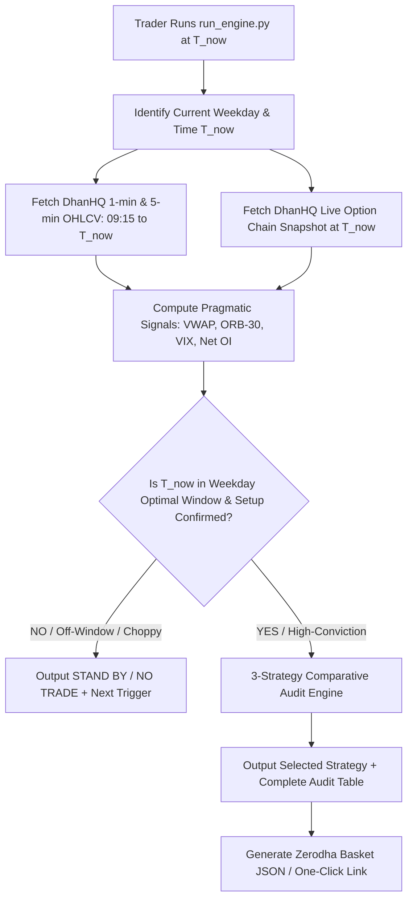
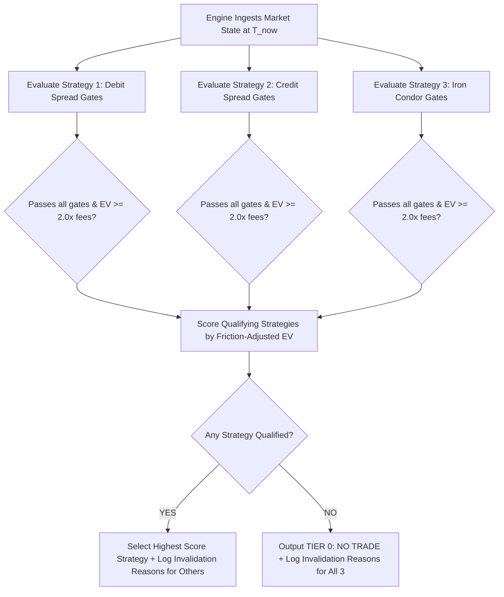
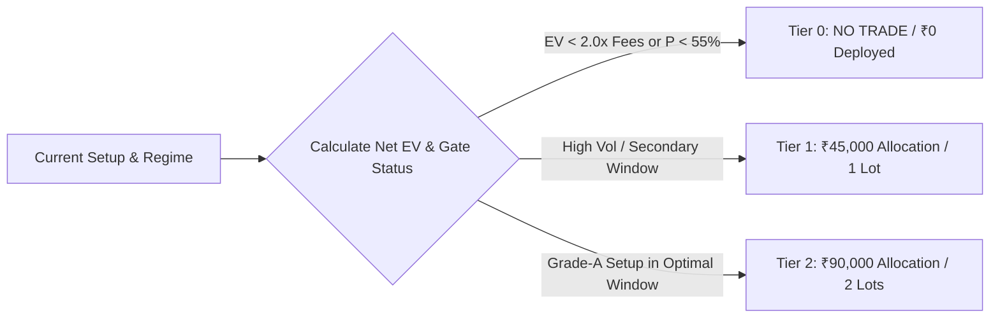

# Business Requirements Document (BRD)
## Quantitative Intraday Nifty Options Decision & Execution Engine
### Selective Capital Preservation & Multi-Regime Execution Edition

*Document Version:* 2.1.0 (Pragmatic Quant Edition)  
*Trading Venue:* National Stock Exchange of India (NSE) — Nifty 50 Index Options (Weekly Contracts)  
*Execution Broker:* Zerodha Kite (Semi-Automated Basket Orders with Upfront GTT/SL)  
*Data Feeds:* DhanHQ API (Live/Intraday Ticks, OHLCV & Greeks) + NSE Bhavcopy Archives (5-Year Historical & FO EOD)  
*Capital Bankroll:* Max ₹2,00,000 (Regime-Driven Tier Allocation: ₹40,000 | ₹80,000–₹1,00,000 | ₹1,60,000–₹2,00,000)  
*Execution Mode:* Dynamic On-Demand Execution (Run anytime 09:30 AM – 02:30 PM IST with Weekday-Calibrated Windows)  
*Hard Daily Square-Off:* 03:00 PM IST (Strict Intraday Only — Zero Overnight Gap Risk)

---

## 1. Executive Summary & Pragmatic Quant Doctrine

### 1.1 Core Objective
Design and implement a robust, Unix-style quantitative engine for Nifty 50 weekly options that can be executed **on demand at any time during market hours**. The engine evaluates live price action, volume profile, dealer positioning, and transaction frictions against **weekday-specific historical high-probability windows** to output an unambiguous trading decision:
1. **Trade Recommendation:** One of three core option structures (**Directional Debit Spread**, **Directional Credit Spread**, or **Range-Bound Iron Condor**), complete with exact strikes, upfront per-leg stop losses, and one-click Zerodha basket order formatting.
2. **Comparative 3-Strategy Audit:** An explicit audit showing why the chosen strategy was selected and why each of the other two strategies was rejected.
3. **NO TRADE / Capital Preservation:** If statistical edge is below the hurdle ($P_{\text{win}} < 55\%$ or Expected Net Value $< 2.0\times$ friction), the engine stands down.

### 1.2 The "Do Not Destroy Capital" Doctrine
> **Core Principle:** Long-term compounding in retail derivatives is a mathematical function of positive Expected Value ($EV > 0$), asymmetric payoff ratios ($b \ge 1.4$), and ruthless capital preservation. It is **never** achieved by forcing daily trades to meet an arbitrary income quota.

* **The Fallacy of the Guaranteed "Daily Wage":** Expecting any market engine to generate a fixed "₹2,000 every day" regardless of regime is the primary behavioral cause of retail ruin. The Indian derivatives market is a negative-sum game after brokerages, exchange turnover, and regulatory taxes (specifically the revised October 2024 STT of 0.1% on options sales). Forcing trades on low-conviction or choppy days churns capital into transaction fees.
* **The 55% Win Rate + Asymmetric Payoff Risk Model:**
  * Market direction cannot be predicted with 80%–90% certainty without curve-fitting.
  * We target a realistic, statistically robust out-of-sample win rate: **$P_{\text{win}} \ge 55\%$**.
  * By enforcing a minimum **Payoff Ratio of $b \ge 1.4$** (Target Profit : Max Risk) and cutting losers strictly at 1.0%–1.25% of total capital (₹2,000–₹2,500 max daily loss), the mathematical expectancy per trade is decisively positive:
    $$\mathbb{E}[\text{Net EV}] = \left(0.55 \times \text{Avg Win}\right) - \left(0.45 \times \text{Avg Loss}\right) - \mathcal{C}_{\text{Friction}} > 0$$
  * On a risk unit of ₹2,500 with a 1.4 payoff (₹3,500 target), the gross expectancy is $+₹800$ per trade. After ~₹190 Zerodha round-trip friction, net EV is $+₹610$ per active session.
  * Executing **8 to 14 high-conviction trades per month** yields consistent compounding while preserving capital on noisy days.
* **Strict Single-Day Intraday Horizon (Zero Overnight Gap Risk):** All positions enter intraday and strictly square off by 03:00 PM IST (02:45 PM on Thursday expiries). Multi-day holding is prohibited. Carrying options overnight exposes a small ₹2L bankroll to unpredictable GIFT Nifty morning gaps that blow past broker stop-losses before 09:15 AM.

---

## 2. Dynamic On-Demand Execution & Weekday Timing Architecture

Rather than locking execution into an arbitrary single-shot time (like 10:00 AM), the engine can be executed **on demand at any time between 09:30 AM and 02:30 PM IST**. 



### 2.1 Weekday-Specific Intraday Seasonality Matrix
Indian index options exhibit distinct intraday behavioral patterns across the trading week due to institutional order flow, expiry cycles, and global macro handoffs. Walk-forward testing calibrates optimal execution windows per weekday:

| Weekday | Market Dynamics & Institutional Profile | Primary Optimal Window | Secondary Window | High-Risk Window (Avoid) |
| :--- | :--- | :--- | :--- | :--- |
| **Monday** | Weekend gap digestion, opening false breakouts, FII re-balancing | **10:00 AM – 10:45 AM** (Post-gap stabilization) | 01:15 PM – 02:00 PM | 09:15 AM – 09:45 AM (Opening whipsaws) |
| **Tuesday** | Cleanest directional momentum drift, lower path noise | **09:45 AM – 10:30 AM** (Opening range expansion) | 12:45 PM – 01:30 PM (European open) | 11:15 AM – 12:30 PM (Midday lull) |
| **Wednesday** | Pre-expiry theta decay acceleration, range compression | **10:00 AM – 11:00 AM** (Premium decay initiation) | 01:30 PM – 02:15 PM | 09:15 AM – 09:45 AM |
| **Thursday** | **Nifty Weekly Expiry Day**: Severe gamma spikes, pinning vs squeezes | **Window 1: 09:35 AM – 10:15 AM** (Morning range fade)<br>**Window 2: 01:15 PM – 02:00 PM** (Afternoon gamma squeeze) | N/A (Binary day) | 11:30 AM – 01:00 PM & **Post-02:45 PM** (Gamma explosion) |
| **Friday** | Low volatility drift, new weekly contract buildup, low delta sensitivity | **10:15 AM – 11:00 AM** (Initial structure set) | None (Low EV) | Post 01:30 PM (Weekend risk aversion) |

### 2.2 On-Demand Execution Behavior
When `run_engine.py` is invoked at time $T_{\text{now}}$:
1. **Window Alignment Check:** Compares $T_{\text{now}}$ with the day's calibrated windows. If running outside high-conviction windows (e.g. 12:00 PM on Friday), the system applies a stricter friction hurdle ($EV \ge 3.0\times$ fees).
2. **Dynamic Ingestion (09:15 to $T_{\text{now}}$):** Aggregates all 1-min and 5-min candles from 09:15 AM up to the current minute.
3. **Actionable Directive:**
   * If a high-probability setup is active: outputs the exact order sheet, strike selection, and risk metrics.
   * If the market is consolidating or in between windows: outputs `STAND BY: Watching for breakout above 25,320 or breakdown below 25,240. Next optimal window: 01:15 PM`.

---

## 3. Pragmatic Market Microstructure Signals (Kailash Nadh Standard)

Rather than using fragile academic models (like 10-day rolling Hurst exponents or 3-state HMMs that suffer from non-stationary transition matrices), the engine evaluates **five deterministic, battle-tested microstructure signals**.

```
+---------------------------------------------------------------------------------------+
|                    PRAGMATIC MARKET MICROSTRUCTURE STACK                              |
+---------------------------------------------------------------------------------------+
| 1. VWAP & Dynamic Multi-Timeframe Slope (Institutional Direction & Participation)     |
| 2. 30-Minute Opening Range Breakout / Compression (ORB-30: 09:15–09:45 AM)            |
| 3. India VIX & Option Implied Volatility (IV Premia: ATM Straddle vs Realized Vol)    |
| 4. Open Interest (OI) Microstructure & Dealer Walls (Strike-by-Strike Support/Resist) |
| 5. Kaufman Efficiency Ratio (KER: Path Noise vs Directional Efficiency Filter)        |
+---------------------------------------------------------------------------------------+
```

### 3.1 Signal 1: Volume-Weighted Average Price (VWAP) & Dynamic Slope
* **Purpose:** Identifies the true institutional benchmark and intraday directional control.
* **Mathematical Formulation:**
  $$\text{VWAP}_t = \frac{\sum_{i=1}^t \text{Price}_i \times \text{Volume}_i}{\sum_{i=1}^t \text{Volume}_i}$$
  $$\text{Slope}_{\text{VWAP}}(t, k) = \frac{\text{VWAP}_t - \text{VWAP}_{t-k}}{\text{VWAP}_{t-k}} \times 100 \quad (k = 3 \text{ bars / 15 mins})$$
* **Standard Deviation Bands:**
  $$\text{Upper Band} = \text{VWAP}_t + 1.5 \times \sigma_{\text{VWAP}}, \quad \text{Lower Band} = \text{VWAP}_t - 1.5 \times \sigma_{\text{VWAP}}$$
* **Decision Rules:**
  * **Bullish Institutional Dominance:** $\text{Price}_t > \text{VWAP}_t$ AND $\text{Slope}_{\text{VWAP}} > +0.02\%$ per 15 min.
  * **Bearish Institutional Dominance:** $\text{Price}_t < \text{VWAP}_t$ AND $\text{Slope}_{\text{VWAP}} < -0.02\%$ per 15 min.
  * **Institutional Equilibrium (Chop):** Price oscillating within $\pm 0.5 \sigma_{\text{VWAP}}$ with flat slope ($|\text{Slope}| \le 0.01\%$).

### 3.2 Signal 2: 30-Minute Opening Range Breakout (ORB-30) & Range Compression
* **Purpose:** Defines the morning boundary conditions established during initial price discovery (09:15–09:45 AM).
* **Mathematical Formulation:**
  $$\text{ORH} = \max_{09:15 \le t \le 09:45}(\text{High}_t), \quad \text{ORL} = \min_{09:15 \le t \le 09:45}(\text{Low}_t)$$
  $$\text{Opening Range Width} = \text{ORH} - \text{ORL}$$
* **Breakout Confirmation Guardrails:**
  * A breakout above $\text{ORH}$ or below $\text{ORL}$ is only valid if:
    1. A 5-minute candle **closes** outside the range (eliminating wick traps).
    2. The breakout candle's volume is $\ge 1.4\times$ the 20-day average volume for that 5-min interval.
* **Range Compression Trigger:** If $\text{Opening Range Width} < 0.35\%$ of Spot Price (~85 Nifty points), the market is in compression, signaling a high-probability Iron Condor or impending volatility expansion.

### 3.3 Signal 3: India VIX & Option Implied Volatility (IV) Dynamics
* **Purpose:** Determines whether options are overpriced (favoring premium selling / credit spreads) or underpriced (favoring premium buying / debit spreads).
* **Metrics Ingested:**
  1. **Absolute India VIX:**
     * $VIX < 12.5$: Low volatility regime. Option premiums are cheap; selling credit yields insufficient buffer against tail spikes. Favors **Debit Spreads**.
     * $12.5 \le VIX \le 16.5$: Normal volatility regime. Balanced risk-reward for both credit and debit spreads.
     * $VIX > 16.5$: Elevated volatility regime. Options are richly priced. Favors **Credit Spreads & Iron Condors**.
  2. **Intraday VIX Delta ($\Delta \text{VIX}$):**
     $$\Delta \text{VIX}_t = \frac{\text{VIX}_t - \text{VIX}_{\text{prev\_close}}}{\text{VIX}_{\text{prev\_close}}} \times 100$$
     * $\Delta \text{VIX} > +4.0\%$: Volatility expansion (flight to puts, steepening skew). Rejects unhedged credit selling.
     * $\Delta \text{VIX} < -3.0\%$: Volatility crush (post-event or morning calm). Ideal for credit decay.
  3. **ATM Straddle IV vs Realized Parkinson Volatility:**
     $$\text{IV Spread} = \text{ATM Straddle IV} - \sigma_{\text{Parkinson}}(20\text{d})$$
     If $\text{IV Spread} > +3.0 \text{ points}$, options carry high volatility premium $\to$ Strong edge for **Credit Spreads / Iron Condors**.

### 3.4 Signal 4: Open Interest (OI) Microstructure & Dealer Walls
* **Purpose:** Evaluates dealer hedging commitments and identifies real-time strike magnets and barriers.
* **Metrics Calculated from DhanHQ Live Option Chain:**
  1. **Strike-Level Call/Put OI and Change in OI ($\Delta \text{OI}$):**
     * **Call Wall (Major Resistance):** Strike with highest Call OI within $\pm 300$ points of spot.
     * **Put Wall (Major Support):** Strike with highest Put OI within $\pm 300$ points of spot.
  2. **Put-Call Ratio (PCR) Momentum:**
     $$\text{PCR}_{\text{Volume}} = \frac{\sum \text{Put Volume}}{\sum \text{Call Volume}}, \quad \text{PCR}_{\text{OI}} = \frac{\sum \text{Put OI}}{\sum \text{Call OI}}$$
     $$\Delta \text{PCR} = \text{PCR}_{\text{OI}}(t) - \text{PCR}_{\text{OI}}(09:30)$$
     * $\Delta \text{PCR} > +0.15$ with rising spot $\to$ Strong institutional put writing (bullish floor).
     * $\Delta \text{PCR} < -0.15$ with falling spot $\to$ Heavy call writing / put unwinding (bearish cap).

### 3.5 Signal 5: Kaufman Efficiency Ratio (KER)
* **Purpose:** Quantifies path efficiency versus noise to prevent taking directional trades during choppy oscillations.
* **Mathematical Formulation:**
  $$\text{KER}_t = \frac{|\text{Price}_t - \text{Price}_{t-n}|}{\sum_{i=0}^{n-1} |\text{Price}_{t-i} - \text{Price}_{t-i-1}|} \quad (n = 20 \text{ bars / 100 mins})$$
* **Thresholds:**
  * $\text{KER} > 0.55$: High directional efficiency. Trend is clean. Directional Spreads approved.
  * $\text{KER} < 0.35$: Path is predominantly noise and churn. Directional trades **strictly vetoed**; only Iron Condor or NO TRADE permitted.

---

## 4. The 3 Core Strategy Archetypes & Mandatory Comparative Audit

To eliminate strategy bloat, reduce execution drag, and fit within the margin dynamics of a ₹2,00,000 account trading Nifty (lot size 75), the universe is pruned down to **three core option structures** plus the **NO TRADE** state.

```
+----------------------------------------------------------------------------------------+
|                          THE 3 CORE OPTION STRUCTURES                                  |
+----------------------------------------------------------------------------------------+
| 1. DIRECTIONAL DEBIT SPREAD  | Bull Call Spread / Bear Put Spread                      |
|                              | Used when: High KER, clean VWAP trend, cheap IV/VIX    |
+------------------------------+---------------------------------------------------------+
| 2. DIRECTIONAL CREDIT SPREAD | Bull Put Spread / Bear Call Spread                      |
|                              | Used when: Moderate trend, strong OI Wall, rich IV/VIX  |
+------------------------------+---------------------------------------------------------+
| 3. RANGE-BOUND IRON CONDOR   | 4-Leg Neutral Credit Spread                             |
|                              | Used when: Low KER, price inside ORB, high IV, pin GEX  |
+------------------------------+---------------------------------------------------------+
| [FALLBACK] TIER 0: NO TRADE  | 100% Cash Preservation                                  |
|                              | Used when: Noise regime, EV < 2.0x fees, binary events  |
+------------------------------+---------------------------------------------------------+
```

### 4.1 Detailed Strategy Rules & Strike Selection

#### Strategy 1: Directional Debit Vertical Spread (Bull Call / Bear Put)
* **Objective:** Capture asymmetric directional moves while capping max loss to the net debit paid.
* **Activation Gates:**
  * Confirmed ORB-30 breakout with volume confirmation.
  * $\text{KER} > 0.55$ (clean path efficiency).
  * Price on correct side of VWAP with $\text{Slope}_{\text{VWAP}} > |0.02\%|$.
  * $VIX \le 16.0$ OR $\text{IV Spread} \le +2.0$ (options not overpriced).
* **Strike Construction (Current Weekly Expiry):**
  * **Long Leg:** ATM Strike ($\Delta \approx 0.50$, nearest 50-pt strike to Spot).
  * **Short Leg:** OTM Strike 150–200 points away ($\Delta \approx 0.25$).
* **Risk & Profit Rules:**
  * **Upfront Stop-Loss:** Hard stop at **35% loss of net debit paid**.
  * **Profit Target:** **70% of max spread profit** OR 1:1.5 Risk/Reward.

#### Strategy 2: Directional Credit Vertical Spread (Bull Put / Bear Call)
* **Objective:** Harvest theta decay and volatility contraction with directional skew support.
* **Activation Gates:**
  * Spot supported by major Dealer OI Wall (Put wall for Bull Put; Call wall for Bear Call).
  * Price on correct side of VWAP, but slope is moderate ($|0.01\%| \le \text{Slope} \le 0.03\%$).
  * $VIX \ge 13.0$ AND $\text{IV Spread} \ge +1.5$ (collecting sufficient premium).
* **Strike Construction (Current Weekly Expiry):**
  * **Hedge Leg (BUY FIRST):** Deep OTM Strike ($\Delta \approx 0.10$, 150 pts beyond short leg).
  * **Short Leg (SELL SECOND):** OTM Strike at or beyond the OI Wall ($\Delta \approx 0.22$).
* **Risk & Profit Rules:**
  * **Upfront Stop-Loss:** Hard stop when short leg premium reaches **1.4x of credit received** (Net MTM cap at ₹2,200).
  * **Profit Target:** **65% credit decay**.

#### Strategy 3: Range-Bound Neutral Iron Condor
* **Objective:** Collect double-wing decay on range-bound, low-momentum sessions.
* **Activation Gates:**
  * Price trapped inside ORB-30 ($\text{ORH}$ and $\text{ORL}$ intact).
  * $\text{KER} < 0.35$ (choppy oscillation; no directional drift).
  * $|\text{Slope}_{\text{VWAP}}| \le 0.01\%$ (flat institutional benchmark).
  * Balanced Call & Put OI clusters flanking spot price.
* **Strike Construction (4 Legs — 1 Lot each):**
  * **Leg 1 (BUY FIRST):** OTM Put Hedge ($\Delta \approx 0.08$, 150 pts below short put).
  * **Leg 2 (BUY FIRST):** OTM Call Hedge ($\Delta \approx 0.08$, 150 pts above short call).
  * **Leg 3 (SELL):** OTM Short Put ($\Delta \approx 0.20$, below Put Wall).
  * **Leg 4 (SELL):** OTM Short Call ($\Delta \approx 0.20$, above Call Wall).
* **Risk & Profit Rules:**
  * **Upfront Stop-Loss:** **1.4x of total net credit collected** OR breach of either short strike by spot price.
  * **Profit Target:** **50% of total credit collected**.

---

### 4.2 The Mandatory 3-Strategy Comparative Audit Engine

Every time the engine is executed, it **must explicitly evaluate all 3 strategies** and print an unambiguous audit table. It is not sufficient to simply output the winning trade; the trader must see exactly why each alternative was disqualified.



#### The Audit Formulation Matrix:
For each strategy $s \in \{\text{Debit Spread}, \text{Credit Spread}, \text{Iron Condor}\}$:
$$\text{AuditStatus}(s) = \begin{cases} 
\text{SELECTED} & \text{if } s = \arg\max \text{Score}_k \text{ and } \text{Score}_k > 0 \\
\text{REJECTED} & \text{with primary failed quantitative gate and metric value}
\end{cases}$$

#### Example Production Comparative Audit Output:
```
┌── COMPARATIVE 3-STRATEGY ELIMINATION & SELECTION AUDIT ───────────────────────────────┐
│ Strategy               Status     EV Score  Primary Invalidation Reason / Gate Result │
│ ───────────────────────────────────────────────────────────────────────────────────── │
│ 1. Debit Spread        SELECTED   +₹840.00  PASSED: ORB-30 Breakout confirmed,       │
│                                             KER 0.62 > 0.55, VWAP slope +0.034%/15m  │
│ 2. Credit Spread       REJECTED   +₹210.00  REJECTED: IV Spread (+0.4) too low;       │
│                                             credit collected (₹28) fails 2.0x fee gate│
│ 3. Iron Condor         REJECTED   -₹450.00  REJECTED: Directional breakout detected; │
│                                             KER 0.62 breaches max chop threshold 0.35│
│ ───────────────────────────────────────────────────────────────────────────────────── │
│ FINAL VERDICT: NIFTY BULL CALL DEBIT SPREAD SELECTED (High Momentum + Clean Trend)     │
└───────────────────────────────────────────────────────────────────────────────────────┘
```

---

## 5. Capital Preservation, Sizing & The 55% Win Rate Risk Model

### 5.1 The Positive Expectancy Mathematical Proof
A retail trader does not need an unrealistic 80% win rate to be consistently profitable. The engine is engineered around a statistically verifiable **55% win rate** ($P_{\text{win}} = 0.55$) with an **asymmetric payoff ratio ($b \ge 1.4$)**.

#### Numerical Proof on ₹2,00,000 Bankroll:
* **Account Bankroll ($C$):** ₹2,00,000.
* **Risk Cap Per Trade ($R$):** 1.25% of bankroll = **₹2,500 maximum loss**.
* **Target Payoff Ratio ($b$):** 1.40 minimum.
* **Average Winning Trade ($\overline{W}$):** $1.40 \times ₹2,500 = \mathbf{₹3,500}$.
* **Average Losing Trade ($\overline{L}$):** Fixed at hard stop = $\mathbf{₹2,500}$.
* **Round-Trip Zerodha Friction ($\mathcal{C}$):** ₹190.00 (Brokerage, STT, turnover, GST, slippage).

$$\text{Gross Expected Value} = (0.55 \times ₹3,500) - (0.45 \times ₹2,500) = ₹1,925 - ₹1,125 = +\mathbf{₹800.00}$$
$$\text{Net Expected Value Per Trade} = +₹800.00 - ₹190.00 = +\mathbf{₹610.00}$$

#### Monthly Expectation (12 Selective Trades / Month):
* Expected Monthly Net Gain: $12 \times ₹610 = \mathbf{+₹7,320}$ (~3.66% monthly on ₹2L capital / ~44% annualized).
* Maximum Allowable Monthly Drawdown: **5% (₹10,000)**. If hit, trading halts for the remainder of the calendar month.

### 5.2 Capital Deployment Tiers (Nifty Lot Size = 75)



1. **Tier 0 — Capital Preservation (₹0 Deployed):**
   * Triggered when market regime is noise ($0.35 \le \text{KER} \le 0.55$), price inside contested CPR/VWAP, or $EV < 2.0\times$ friction.
2. **Tier 1 — Standard Execution (₹40,000 – ₹50,000 / 1 Lot):**
   * Used for standard 1-lot Nifty spreads (75 quantity).
   * **Max Capital at Risk:** Hard cap at **₹2,000**.
3. **Tier 2 — High Confluence Institutional Setup (₹80,000 – ₹1,00,000 / 2 Lots):**
   * Triggered only when: Setup occurs inside the weekday's primary optimal window, volume $\ge 1.8\times$ average, and $\text{KER} > 0.65$.
   * **Max Capital at Risk:** Hard cap at **₹2,500** across both lots.

---

## 6. Zerodha Friction, Taxes & Hurdle Engine

Every trade must clear real-world regulatory and broker friction before being recommended.

### 6.1 Zerodha & Regulatory Cost Model (Nifty Options — Updated Post-Oct 2024 SEBI Norms)
For an $N$-leg trade with $L$ lots ($Q = L \times 75$ index quantity):
1. **Brokerage:** Flat ₹20 per executed order leg ($\text{Roundtrip} = 2 \times N \times ₹20$).
2. **STT (Securities Transaction Tax):** **0.1% on sell-side option premium turnover** (revised October 1, 2024).
3. **NSE Exchange Turnover:** 0.0505% on premium turnover.
4. **SEBI Charges:** ₹10 per crore (0.0001%).
5. **Stamp Duty:** 0.003% on buy-side premium turnover.
6. **GST:** 18% on (Brokerage + Exchange Turnover + SEBI).
7. **Modeled Slippage Buffer:** 1.0 to 1.5 index points per leg on market/aggressive limit fills.

### 6.2 The Economic Hurdle Rate
$$\text{Friction Cost } (\mathcal{C}_{\text{friction}}) = \text{Brokerage} + \text{STT} + \text{Exchange} + \text{SEBI} + \text{Stamp} + \text{GST} + \text{Slippage}$$
$$\text{Approval Condition:} \quad \mathbb{E}[\text{Gross Profit}] \ge 2.0 \times \mathcal{C}_{\text{friction}} \quad \text{AND} \quad P_{\text{win}}(\text{OOS}) \ge 55\%$$
If these inequalities are not satisfied, the trade is automatically vetoed as uneconomic.

---

## 7. Modular Unix-Style Architecture

Following the Unix engineering philosophy: *Do one thing, do it well, communicate via clean data contracts (pure functions, dataclasses, standard DataFrames), and avoid framework bloat.*

```
d:\Code\dhanopt\
├── AGENTS.md                  # Lazy senior dev rules
├── brd.md                     # This specifications document
├── config.py                  # Single source of truth: capital caps, API keys, fee tables
├── data/                      # Local Parquet caches, trade_journal.sqlite & calibrated_params.json
├── core/                      # Decoupled generic modules (zero circular dependencies)
│   ├── feeds/                 # DATA INGESTION: Independent data providers
│   │   ├── base.py            # Abstract BaseFeed interface (fetch_candles, fetch_chain)
│   │   ├── dhan.py            # DhanHQ implementation with tenacity exponential backoff
│   │   └── bhavcopy.py        # jugaad-data historical NSE archive sync
│   ├── signals/               # PURE MATHEMATICS: Stateless microstructure signals
│   │   ├── vwap.py            # Multi-timeframe VWAP & slope calculation
│   │   ├── orb.py             # 30-min Opening Range Breakout (ORB-30) & compression
│   │   ├── vix_iv.py          # India VIX & ATM Straddle IV vs Realized Parkinson Vol
│   │   ├── oi_micro.py        # Strike-by-strike Call/Put OI, Delta OI, and PCR trend
│   │   └── ker.py             # Kaufman Efficiency Ratio (09:15-T_now momentum efficiency)
│   ├── regime/                # REGIME CLASSIFICATION: State identification
│   │   └── evaluator.py       # Microstructure rule evaluator (Bull Trend / Bear Trend / Range / Noise)
│   ├── strategies/            # THE 3 CORE STRATEGIES: Generic, pluggable strategy objects
│   │   ├── base.py            # BaseStrategy interface (can_activate, build_legs, score)
│   │   ├── debit_spread.py    # Bull Call / Bear Put Spread implementation
│   │   ├── credit_spread.py   # Bull Put / Bear Call Spread implementation
│   │   ├── iron_condor.py     # 4-Leg Neutral Iron Condor implementation
│   │   └── audit_engine.py    # Mandatory 3-strategy comparative elimination & scoring engine
│   ├── friction/              # PURE COST ACCOUNTING: Transaction costs & breakeven
│   │   └── zerodha.py         # Zerodha brokerage, Oct 2024 SEBI STT, turnover, GST, slippage math
│   ├── auditors/              # DETERMINISTIC AUDIT: Zero-AI sanity & safety gatekeeper
│   │   └── rule_gatekeeper.py # Pure Python rule-based risk, liquidity, and 55% EV veto checks
│   ├── execution/             # ONE-CLICK EXECUTION: Eliminates manual lag
│   │   └── basket_builder.py  # Generates Zerodha Kite Basket JSON & One-Click Publisher URL
│   ├── journal/               # POST-TRADE LEARNING: SQLite attribution & telemetry
│   │   └── recorder.py        # Logs MAE, MFE, fill slippage, and regime failure attribution
│   └── ui/                    # PRESENTATION & DELIVERY: Decoupled output layers
│       ├── terminal_rich.py   # Python rich multi-panel terminal renderer with audit table
│       └── telegram_push.py   # Instant Telegram bot delivery with copy-paste order matrix
├── backtest/                  # 5-Year Walk-Forward engine (Calibrates weekday windows & parameters)
│   └── engine.py              # Event-driven walk-forward engine emitting calibrated_params.json
├── run_engine.py              # Dynamic on-demand master runner (can be run anytime)
└── tests/
    └── test_modules.py        # Independent assert-based self-checks per module
```

---

## 8. Comprehensive Report & Telegram Output Specification

When `run_engine.py` executes, it renders a multi-panel terminal report via Python's [`rich`](https://github.com/Textualize/rich) library and pushes a formatted copy-paste order sheet to Telegram.

### 8.1 Terminal Output (Example: Wednesday 10:15 AM Execution)

```markdown
══════════════════════════════════════════════════════════════════════════════════════
 QUANTITATIVE NIFTY OPTIONS ON-DEMAND ENGINE | 10:15 AM IST
 Execution Broker: Zerodha Kite | Data Feed: DhanHQ API + 5-Yr Walk-Forward
══════════════════════════════════════════════════════════════════════════════════════
 Run Timestamp: 2026-09-30 10:15:02 IST (Wednesday) | Status: ACTIVE TRADE CONFIRMED
 Underlying: NIFTY 50 Spot: 25,240.50 | VWAP: 25,215.00 | India VIX: 13.2 (-1.5%)
 Weekday Window Status: OPTIMAL (Wednesday Window: 10:00 AM – 11:00 AM Active)
──────────────────────────────────────────────────────────────────────────────────────

┌── PANEL 1: MARKET MICROSTRUCTURE DIAGNOSTICS ────────────────────────────────────────┐
│ • Opening Range (09:15–09:45): ORH: 25255.0 | ORL: 25195.0 | Range Width: 60 pts     │
│ • ORB Status: Confirmed Bullish Breakout (5-min close at 25,260 with 1.6x volume)    │
│ • VWAP Trend: Price > VWAP (+25.5 pts) | 15-min VWAP Slope: +0.032% (Strong Bullish) │
│ • Momentum Efficiency (KER): 0.64 (Clean trend drift; low path noise)                │
│ • Volatility State: India VIX 13.2 | ATM Straddle IV: 12.8 | Realized Parkinson: 11.4│
│ • Dealer Positioning: Call Wall at 25400 | Put Wall at 25100 | Delta PCR: +0.18      │
└──────────────────────────────────────────────────────────────────────────────────────┘

┌── PANEL 2: MANDATORY 3-STRATEGY COMPARATIVE AUDIT ───────────────────────────────────┐
│ Strategy            Status    WinRate   EV Score   Gate Evaluation / Audit Reason    │
│ ──────────────────────────────────────────────────────────────────────────────────── │
│ 1. Debit Spread     SELECTED  59.2%     +₹780.00   PASSED: ORB-30 Breakout confirmed,│
│    (Bull Call)                                     KER 0.64 > 0.55, VWAP slope > 0   │
│ 2. Credit Spread    REJECTED  52.1%     +₹180.00   REJECTED: IV Spread low (+1.4);   │
│    (Bull Put)                                      net credit fails 2.0x fee hurdle  │
│ 3. Iron Condor      REJECTED  38.5%     -₹410.00   REJECTED: Trend breakout active;  │
│                                                    KER 0.64 breaches max chop cap    │
│ ──────────────────────────────────────────────────────────────────────────────────── │
│ SELECTION VERDICT: BULL CALL DEBIT SPREAD (Score: 3.20 | Expected Net EV: +₹780.00)  │
└──────────────────────────────────────────────────────────────────────────────────────┘

┌── PANEL 3: RECOMMENDED ZERODHA BASKET ORDER SHEET ───────────────────────────────────┐
│ Strategy: NIFTY BULL CALL SPREAD | Expiry: Current Weekly (01-OCT-2026)              │
│ Sizing: 1 Lot (75 Qty) | Total Capital Outlay: ₹5,700.00                             │
│                                                                                      │
│ Basket Order Execution Sequence:                                                     │
│ 1st [BUY]  NIFTY 25250 CE | Entry LTP: ₹110.00 | Upfront SL: ₹75.00 (-35 pts)        │
│ 2nd [SELL] NIFTY 25400 CE | Entry LTP: ₹34.00  | Upfront SL: ₹52.00 (+18 pts)        │
│ *(CRITICAL: Buy Leg 1 first to secure Zerodha margin relief)*                        │
│                                                                                      │
│ Risk & Return Metrics:                                                               │
│ • Net Debit Paid: ₹76.00 per share (₹5,700 capital deployed)                         │
│ • Net Portfolio Stop-Loss: -₹2,100 MTM (Exit both legs immediately if reached)       │
│ • Net Profit Target: +₹3,600 MTM (1:1.7 Risk/Reward)                                 │
│ • Zerodha Round-Trip Friction: ₹188.40 (~2.51 Nifty points across 75 qty)            │
│ • Hard Exit Timestamp: 03:00 PM IST (Strict Intraday — Zero Overnight Carry)        │
└──────────────────────────────────────────────────────────────────────────────────────┘
```

### 8.2 One-Click Zerodha Basket Execution (`core/execution/basket_builder.py`)
To solve the 60–90 second manual execution delay, `basket_builder.py` produces:
1. A **Zerodha Kite JSON Basket file** that can be imported directly into Kite Web.
2. A **Kite Publisher / One-Click Link** sent to Telegram that opens the Zerodha mobile app with the legs pre-sequenced (long leg first) so the user can execute with a single swipe.

---

## 9. Failure Modes, Edge Cases & Circuit Breakers

| Failure Scenario | Institutional Safeguard & Circuit Breaker |
| :--- | :--- |
| **Random Walk / Choppy Session** | Kaufman Efficiency Ratio filter ($\text{KER} < 0.35$) and unconfirmed ORB-30 trigger **TIER 0: NO TRADE**. Protects bankroll from churn. |
| **Off-Window Execution** | Running the script outside optimal weekday windows triggers an elevated hurdle rate ($EV \ge 3.0\times$ fees) to prevent over-trading in dead zones. |
| **Margin Shortfall on Short Wings** | Execution engine strictly enforces buying long hedge wings first, verifying Zerodha margin requirements prior to order submission. |
| **Consecutive Loss Prevention** | **1 Trade Per Day Rule.** If the active trade hits its stop-loss, trading terminates for the day. **3 consecutive losing sessions** trigger a mandatory 48-hour cool-off and walk-forward re-calibration. |
| **Monthly Drawdown Circuit Breaker** | If cumulative realized losses reach **₹10,000 (5.0% of ₹2L capital)** in a calendar month, trading is automatically halted until the next month. |
| **Expiry Day Afternoon Gamma** | On Thursday weekly expiries, all open positions must square off by **02:45 PM IST** sharp to avoid the final 45-minute zero-day gamma wild swings. |

---

## 9A. ML Research Sandbox (`experiments/`) — Hard Isolation Policy

The `experiments/` directory hosts machine-learning research (LightGBM, SHAP, meta-labeling) aimed at building an **ensemble of decision models** whose goal is to *make better decisions most of the time* — explicitly **not** to minimize trading activity. Fewer losses at roughly the same number of trades is the success metric.

Non-negotiable constraints:
1. **Read-only originals.** Nothing under `experiments/` may modify `core/`, `backtest/`, `config.py`, `run_engine.py`, `trade.py`, or `data/`. Experiments *consume* the engine's modules; they never patch them.
2. **One folder per experiment:** `experiments/e00x_<name>/`, each self-contained (code + README + artifacts). Shared helpers live in `experiments/common/`.
3. **Mandatory Verdicts.** Each experiment README ends with a `## Verdict` section stating what works and what does not, with numbers. An experiment without a written verdict is incomplete.
4. **Sandboxed dependencies.** ML packages are experiment-only; `run_engine.py` and `trade.py` must run without them.
5. **Promotion is explicit.** Findings graduate into `core/` only via a reviewed, user-approved diff after the experiment's acceptance gates (see `experiment.md`) pass.

The detailed research protocol, leakage rules, walk-forward design, and acceptance gates live in [experiment.md](file:///d:/Code/dhanopt/experiment.md).

---

## 10. Verification & Acceptance Criteria

1. **On-Demand Determinism:** Invoking `run_engine.py` with identical market data timestamps must yield the exact same signals, strategy scores, and audit conclusions every time.
2. **Audit Completeness:** The engine must refuse to output an order without generating the complete 3-strategy comparative audit table showing explicit pass/fail reasons for all three archetypes.
3. **Walk-Forward Validation:** Backtests over 5 years (2021–2026) across 16 rolling folds must verify an out-of-sample win rate $P_{\text{win}} \ge 55\%$, profit factor $> 1.5$, and max drawdown $\le 5.5\%$.
4. **Friction Calibration:** Friction model must calculate brokerage, STT (post-Oct 2024 0.1%), turnover, SEBI, GST, and slippage to within $\pm 3\%$ of actual Zerodha contract notes.
